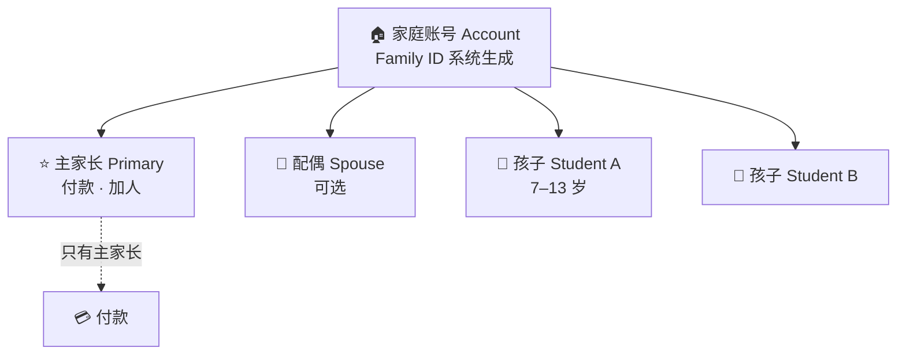
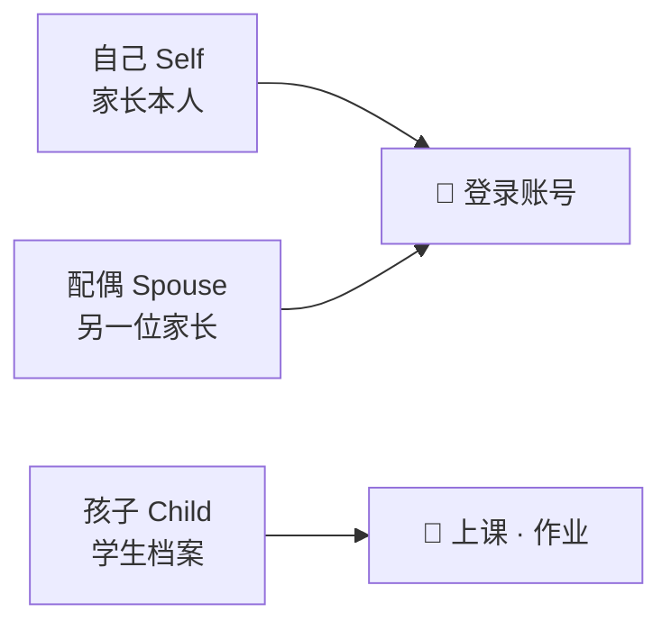
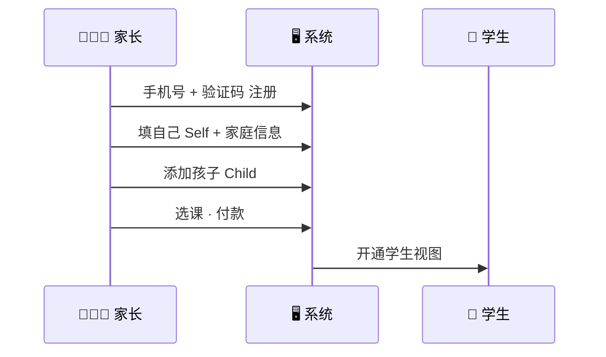

# Accounts & enrollment

[← Wiki home](../README.md)

## Diagrams

### 👨‍👩‍👧 一家人 = 一个 Account



### 🔗 三种家庭关系



### 🛤️ 注册后怎么走



## Core concepts

Three entities must remain distinct:

### Account

- Represents a **family unit** and **billing entity**
- Must have exactly one **primary owner** (parent)
- May include multiple **users** (parents/guardians) and multiple **students**

### User (parent / guardian)

- Individual **login identity**
- Primarily parents/guardians in v1
- May belong to **multiple accounts** (optional; shared guardianship edge cases)
- Manages students within accounts per permissions

### Student

- A **child** enrolled in the school
- Belongs to **exactly one account** (strict)
- Cannot exist on multiple accounts simultaneously

## Relationship diagram

```
Account (family / billing)
├── Primary owner (User) ── billing, payments, add/remove parents
├── Users[] (parents/guardians)
└── Students[] (children)

User ──optional──► many Accounts
Student ──required──► one Account
```

## Requirements

| ID | Requirement | Status |
|----|-------------|--------|
| REQ-ACC-01 | Parents **self-register** their own user accounts. | Confirmed |
| REQ-ACC-02 | Parents **create and manage** student profiles on their account. | Confirmed |
| REQ-ACC-03 | Administrators may **assist** with account/user/student creation when needed; this is not the primary flow. | Confirmed |
| REQ-ACC-04 | Each account has one **primary owner** with exclusive rights to billing, payments, and adding/removing users. | Confirmed |
| REQ-ACC-05 | Non-primary parents may have full access initially; **limited access** is a future option. | Future |

## Profile data at registration

When parents and students are created, collect the fields defined in **[Registration — user fields](registration-user-fields.md)** (source: `WebSiteUserFields.xlsx`):

- **Login:** mobile number, verification code, password, username
- **Identity:** nickname, English/Chinese names, gender, date of birth (students)
- **Contact:** WeChat ID, email, residential address (street, city, state, ZIP)
- **Family:** system **Family Identifier**, **Family Relationship** (Self, Spouse, Child)
- **Roles:** **School Assigned Role** (multiple allowed)
- **Placement:** current regular school name and grade (students)

## Enrollment flow (happy path)

1. Parent registers with **mobile + SMS verification** and password (see [Authentication](authentication.md)).
2. Parent completes **Self** profile; system assigns **Family Identifier** (account).
3. Parent adds **Spouse** and/or **Child** members with relationship and profile fields.
4. Parent assigns **school roles** per person where applicable.
5. Parent selects classes per student and pays — see [Registration & payment](registration-payment.md).
6. Parent uses the **[Parent portal](parent-portal.md)**; students use the [Student portal](student-portal.md) when they have credentials.

## Admin-assisted enrollment

- Admin can create users, students, or fix account linkage on request
- Audit trail recommended (who created/changed what)

## Open questions

| Topic | Notes |
|-------|--------|
| Student login | Can younger students log in themselves, or only via parent? (Clarify with school.) |
| Account merge / split | Divorce or guardianship change — process TBD |

## Related documents

- [Parent portal](parent-portal.md)
- [Registration — user fields](registration-user-fields.md)
- [Glossary](glossary.md)
- [RBAC](rbac.md)
- [Authentication](authentication.md)
- [Registration & payment](registration-payment.md)
