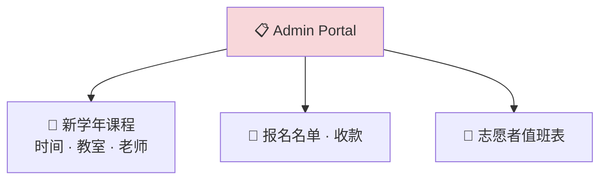
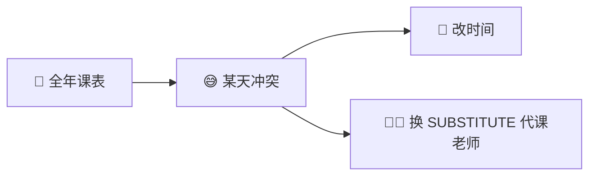

# Admin & management portal

[← Wiki home](../README.md)

## Diagrams

### 📋 管理员：开学前搭好架子

### 🔔 志愿者提醒

### 🔄 单节课调整

## Audience

**School administrators** and designated **staff** with elevated permissions.

## Primary responsibilities

### Academic year setup

- Define **grades** and **classes** (multiple classes per grade — see [School structure](school-structure.md))
- Create **courses** with schedule, classroom, assigned teacher
- Assign **instructors** annually; support **substitute** per session

### User & staff lifecycle

| Staff type | Typical duties |
|------------|----------------|
| **Teachers** | Courses, grading, class announcements |
| **TAs** | Teacher privileges in assigned class; student elsewhere |
| **Parent volunteers** | School-wide announcements, advertising/help, duty shifts |

### Volunteer & duty scheduling

- Calendar for duties (e.g. front desk, hall monitoring)
- **Reminder notifications** a few days before assigned shift
- Roster of who is on duty when

### Timetable management

Admins define the **master timetable**:

- Course / subject
- Time
- Classroom
- Teacher

**Teachers and admins** can:

- Reschedule a **single** session for conflicts
- Assign a **substitute teacher** for one session

### Enrollment & payments

- View enrollment and class rosters
- Track paid / unpaid status
- Override or assist registration when needed

See [Registration & payment](registration-payment.md).

### System configuration

- Enable/disable [authentication](authentication.md) methods
- Manage [RBAC](rbac.md) roles and custom roles
- Reset credentials and assist account recovery

### Frontend ↔ backend map

All dynamic content on the public site and portals is configured here (or in the teacher portal for class-level items). See **[Frontend ↔ backend configuration map](frontend-backend-config.md)** for config paths and **two example use cases per feature**.

| Config area (admin) | Drives on frontend |
|---------------------|-------------------|
| Academic year → Courses | [Course catalog](public-site-content.md#public-course-catalog), enrollment picker, schedules |
| Content → Homepage | [Homepage](public-homepage.md) announcements, events, hero |
| Pricing → Tuition & discounts | Catalog prices, cart, [tuition page](tuition-policies.md) |
| Master schedule & sessions | [Student](student-portal.md) / [parent](parent-portal.md) schedules |
| Communications | School-wide [announcements](announcements.md) |
| Settings | [Contact](contact-and-calendar.md), [authentication](authentication.md), payment gateways |

## Requirements

| ID | Requirement | Status |
|----|-------------|--------|
| REQ-ADM-01 | Admin defines yearly courses, times, rooms, teachers. | Confirmed |
| REQ-ADM-02 | Admin + teacher can reschedule individual sessions. | Confirmed |
| REQ-ADM-03 | Admin + teacher can assign substitute for one session. | Confirmed |
| REQ-ADM-04 | Volunteer duty calendar with advance reminders. | Confirmed |
| REQ-ADM-05 | Admin can view enrollment and payment status. | Confirmed |
| REQ-ADM-06 | Admin can create custom roles and assign permissions. | Confirmed |

## Related documents

- [School structure](school-structure.md)
- [Courses & learning](courses.md)
- [Announcements](announcements.md)
- [RBAC](rbac.md)
