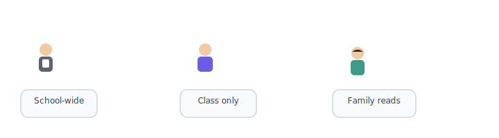

# Announcements & activity feed

[← Wiki home](../README.md)

## Diagrams

| | | | | |
|:---:|:---:|:---:|:---:|:---:|
|  |  |  |  |  |
| Parent | Student | Teacher | Admin | School |

### Who can post

### Who sees what

### How families receive news

## Overview

The platform provides an **activity feed** and **announcements** with role-based posting and visibility scopes.

## Who can post

| Role | Scope |
|------|--------|
| **Admin** | School-wide |
| **Staff** (incl. certain volunteers) | School-wide |
| **Teachers** | Their class(es) |
| **TAs** | Class(es) where they assist |

Parent volunteers helping with **advertising** or school communications may receive staff-level announcement permissions.

## Visibility levels

| Level | Status | Example |
|-------|--------|---------|
| **School-wide** | Confirmed | Registration opens, holiday closure |
| **Class-specific** | Confirmed | Field trip reminder for Class A |
| **Grade-level** | Future | All Grade 2 Chinese families |

## Requirements

| ID | Requirement | Status |
|----|-------------|--------|
| REQ-ANN-01 | Admin and staff can create **school-wide** announcements. | Confirmed |
| REQ-ANN-02 | Teachers and TAs can create **class-level** announcements. | Confirmed |
| REQ-ANN-03 | Feed respects visibility so users only see relevant posts. | Confirmed |
| REQ-ANN-04 | Grade-level targeting may be added later. | Future |

## Public website overlap

Legacy site sections (*Announcement*, *News*) should migrate into this model or dedicated CMS pages on the new public site. Coordinate content strategy with [Overview](overview.md).

## Related documents

- [RBAC](rbac.md)
- [Teacher portal](teacher-portal.md)
- [Admin portal](admin-portal.md)
