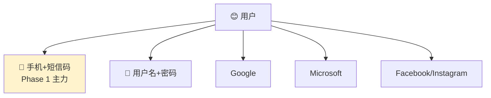
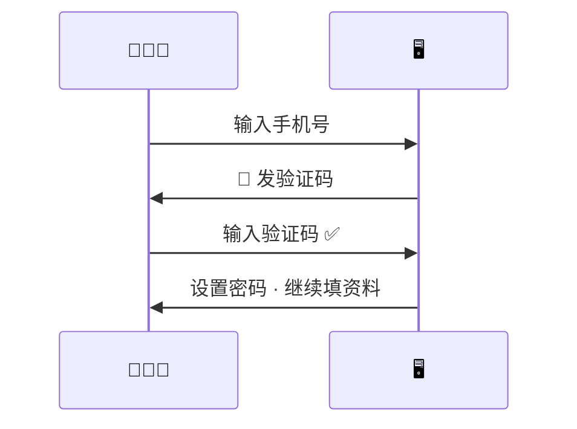
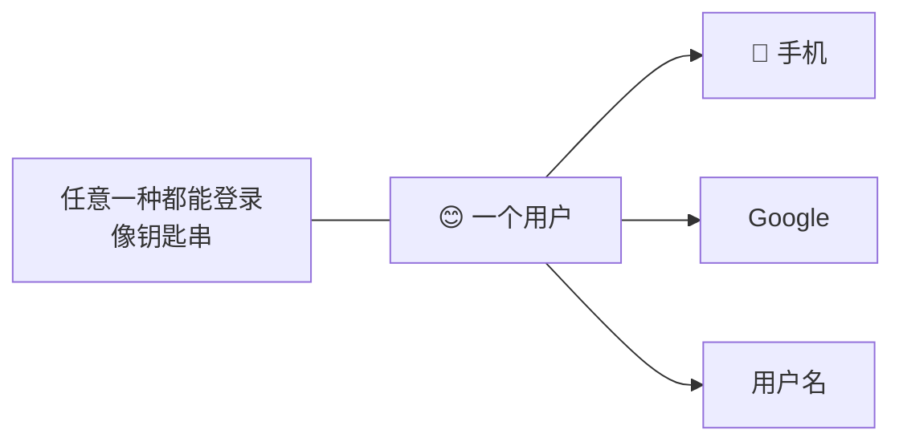

# Authentication

[← Wiki home](../README.md)

## Diagrams

### 🔐 多种登录方式（选你方便的）

### 📱 注册时短信验证

### 🔗 账号可以绑在一起

## Supported login methods

**Phase 1 (registration):** mobile number + **verification code (SMS OTP)** + password; optional **username** as login name. See [Registration — user fields](registration-user-fields.md).

| Method | Status |
|--------|--------|
| Mobile + SMS OTP | Confirmed (phase 1) |
| Username / password | Confirmed |
| Google | Confirmed |
| Microsoft | Confirmed |
| Facebook / Instagram | Confirmed |
| Phone (SMS OTP) | Confirmed |

## Account linking

- One **user** may link **multiple** login methods
- User may sign in with **any** linked method
- Linking and unlinking should be available in account settings (with safeguards)

## Security requirements

| ID | Requirement | Status |
|----|-------------|--------|
| REQ-AUTH-01 | Passwords stored using secure hashing. | Confirmed |
| REQ-AUTH-02 | Rate limiting on auth endpoints. | Confirmed |
| REQ-AUTH-03 | Secure session management. | Confirmed |
| REQ-AUTH-04 | Architecture supports **MFA** in the future. | Future |
| REQ-AUTH-05 | Admins can enable/disable login methods globally. | Confirmed |
| REQ-AUTH-06 | Admins can reset credentials and assist recovery. | Confirmed |

## Admin controls

- Toggle OAuth / SMS providers per school policy
- Force password reset
- Audit log of admin recovery actions (recommended)

## Student vs parent login

Clarify with school whether young students receive their own credentials or access via parent proxy.

## Related documents

- [Accounts & enrollment](accounts.md)
- [RBAC](rbac.md)
