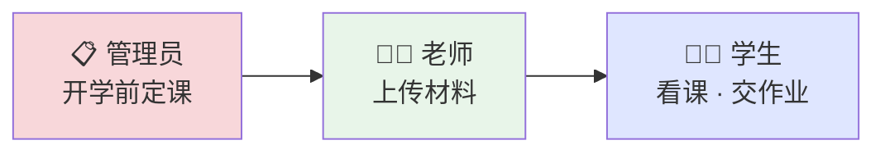
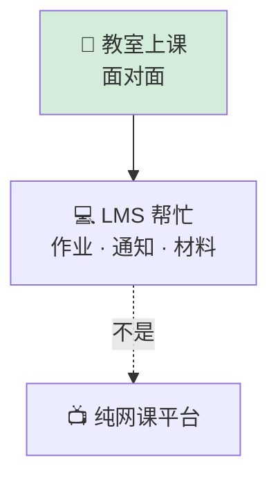
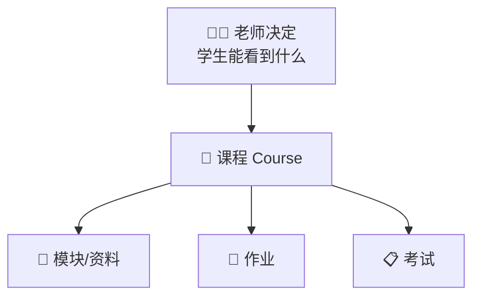

# Courses & learning

[← Wiki home](../README.md)

## Diagrams

### 📅 课程一年生命周期

### 🏫 主要是面对面上课

### 📖 课程页像 Google Classroom

## Philosophy

Learning is **primarily in-person**. The LMS supports:

- Assignments and exams
- Communication (announcements, feedback)
- Materials (PDFs, videos, notes)
- Scheduling and academic tracking

It should **not** assume fully online video-first instruction in v1.

## Course lifecycle

### Annual setup (admin)

At the start of each school year, administrators define:

| Field | Example |
|-------|---------|
| Course name | Grade 2 Chinese — Class A |
| Schedule | Day, time, recurrence |
| Classroom | Room / location |
| Assigned teacher | Primary instructor |

### Ongoing (teacher)

Teachers for each course can:

- Upload **videos**, **PDFs/notes**, **assignments**
- Organize content flexibly (modules/lessons optional — **Google Classroom–like**)
- Control **what students see** on the course page
- Create assignments and exams with attachments
- Assign **different work to different students** in the same class

## Requirements

| ID | Requirement | Status |
|----|-------------|--------|
| REQ-CRS-01 | Admin defines courses yearly (name, schedule, room, teacher). | Confirmed |
| REQ-CRS-02 | Teachers manage course content and visibility. | Confirmed |
| REQ-CRS-03 | Course page includes materials, assignments, announcements, progress. | Confirmed |
| REQ-CRS-04 | Teachers can reschedule a **single session** with admin (occasional conflicts). | Confirmed |
| REQ-CRS-05 | Teachers and admins can assign a **substitute teacher** for one session. | Confirmed |
| REQ-CRS-06 | Course structure should mirror **Google Classroom** usability where practical. | Confirmed |

## Delivery modes (future)

| `delivery_mode` | Description |
|-----------------|-------------|
| `internal` | All LMS features in this platform (default v1) |
| `google_classroom` | External classroom for assignments/materials/grading |
| `hybrid` | Combination |

Platform always owns: registration, payments, account management, scheduling, school/class announcements.

## Course page (student view)

Controlled by teacher; may include:

- Lessons or modules
- Learning materials (PDF, video, notes)
- Assignments and due dates
- Teacher announcements
- Progress tracking

## Related documents

- [School structure](school-structure.md)
- [Student portal](student-portal.md)
- [Teacher portal](teacher-portal.md)
- [Admin portal](admin-portal.md)
