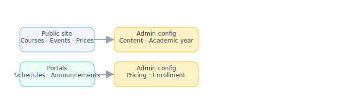

# Frontend ↔ backend configuration map

[← Wiki home](../README.md)

Every **dynamic** item on the public site or in a portal is loaded from data staff configure in the **admin (or teacher) backend**. This page links **what users see** to **where it is configured**, the detailed requirement spec, and **two example use cases** per feature.

**Vendor expectation:** Where practical, give authorized staff a **Configure** or **Manage in admin** link from the frontend preview (staff view) or from in-app help, pointing to the backend screen below.

---

## Summary diagram

---

## Public website (no login)

| Frontend surface | Dynamic content | Backend configuration (admin) | Requirement spec |
|------------------|-----------------|--------------------------------|------------------|
| [Homepage](public-homepage.md) hero | Headline, mission line, CTAs, hero image | **Admin → Content → Homepage → Hero** | [REQ-HOME-02](public-homepage.md#requirements) |
| [Homepage](public-homepage.md) announcements strip | Short notices, publish dates, visibility | **Admin → Content → Homepage → Announcements** | [REQ-HOME-03](public-homepage.md#requirements) |
| [Homepage](public-homepage.md) events list | Dated activities, location, featured flag | **Admin → Content → Homepage → Events** | [REQ-HOME-03](public-homepage.md#requirements) |
| [About](about-school.md) | Mission, history, leadership, youth program copy | **Admin → Content → Pages → About** | [about-school.md](about-school.md) |
| [Contact](contact-and-calendar.md) | Email, phone, addresses, map | **Admin → Settings → School contact** | [REQ-CON-01](contact-and-calendar.md#requirements) |
| [School calendar](contact-and-calendar.md) (public) | Academic year dates, holidays, PDF | **Admin → Content → School calendar** | [REQ-CON-03](contact-and-calendar.md#requirements) |
| [Course catalog](public-site-content.md#public-course-catalog) | Semester, course name, fee, class days, filters | **Admin → Academic year → Courses** | [REQ-CAT-01](public-site-content.md#public-course-catalog) |
| Catalog **prices** | Regular / early-bird per course | **Admin → Courses → Pricing** + **Admin → Pricing → Tuition rules** | [tuition-policies.md](tuition-policies.md) |
| [Tuition & policies](tuition-policies.md) page | Discount rules, refund text, exclusions | **Admin → Pricing → Discounts & refunds** + **Admin → Content → Pages → Tuition** | [tuition-policies.md](tuition-policies.md) |
| Registration CTA / window | Open/closed, deadline messaging | **Admin → Registration → Seasons & deadlines** | [registration-flow.md](registration-flow.md) |
| Footer (all public pages) | Contact, location, links | **Admin → Settings → School contact** + **Admin → Content → Navigation / footer** | [REQ-HOME-09](public-homepage.md#requirements) |
| News / gallery (later) | Articles, albums | **Admin → Content → News** · **Admin → Content → Gallery** | [public-site-content.md](public-site-content.md) |

### Use case examples — public website

#### Homepage hero
- **Example 1:** A prospective parent lands on the site in August; the hero shows “Registration open” and a **Register** button. An admin had updated the hero in **Admin → Content → Homepage → Hero** that morning.
- **Example 2:** Before the lunar new year performance, staff change the hero image and headline to promote the event; visitors see the new hero without a code deploy.

#### Homepage announcements
- **Example 1:** Admin posts “No school Feb 10 — weather” in **Admin → Content → Homepage → Announcements**; it appears on the homepage the same day and auto-hides after the end date.
- **Example 2:** A communications volunteer with `homepage.post_announcement` drafts “Early bird ends March 1”; an admin reviews and publishes from the same screen.

#### Homepage events
- **Example 1:** Staff adds an open house (date, room, description) in **Admin → Content → Homepage → Events**; the event shows in the upcoming list sorted by date.
- **Example 2:** Admin pins a school performance as a featured event near the hero so families see it before scrolling.

#### About page
- **Example 1:** The committee updates the mission paragraph in **Admin → Content → Pages → About**; the public About page reflects the change immediately after publish.
- **Example 2:** A new board member bio is added to the leadership block without editing HTML on the legacy site.

#### Contact page
- **Example 1:** The school changes the main phone number once in **Admin → Settings → School contact**; the Contact page and site footer both update.
- **Example 2:** A parent clicks **email** on Contact; the mailto uses the address configured in admin, not a hard-coded string.

#### Public school calendar
- **Example 1:** Admin uploads the 2026–2027 PDF and key dates in **Admin → Content → School calendar**; families download the calendar before the first day.
- **Example 2:** A snow day is added as “no school” on the calendar view; parents checking the public calendar see the closure without logging in.

#### Course catalog (browse)
- **Example 1:** A visitor filters Saturday classes in the catalog; results come from **Admin → Academic year → Courses** with “publish to catalog” enabled.
- **Example 2:** A returning family compares Grade 3 Class A vs Class B times and fees before creating an account.

#### Catalog prices (early bird vs regular)
- **Example 1:** Before the early-bird deadline, the catalog shows the lower price configured in **Admin → Courses → Pricing**; after the deadline, the regular price displays automatically.
- **Example 2:** Admin sets excluded courses (e.g. robotics) so the catalog still lists them but checkout applies no discount per **Admin → Pricing → Tuition rules**.

#### Tuition & policies page
- **Example 1:** A parent reads sibling discount rules on the public tuition page; the text matches **Admin → Content → Pages → Tuition** and the rules enforced at checkout.
- **Example 2:** Admin updates late-registration tiers in **Admin → Pricing → Discounts & refunds**; the policy page and cart both use the new percentages after publish.

#### Registration CTA / window
- **Example 1:** Admin closes registration in **Admin → Registration → Seasons & deadlines**; the homepage **Register** button shows “Registration closed” with a link to contact the office.
- **Example 2:** Two weeks before open registration, the site shows “Opens March 1” messaging driven by the season start date in admin.

#### Footer
- **Example 1:** Every public page footer shows Canton location and admin@ email from **Admin → Settings → School contact**.
- **Example 2:** Admin adds a “Volunteer” link in **Admin → Content → Navigation / footer**; it appears on all pages without a template change.

#### News / gallery (later)
- **Example 1:** Staff publishes a photo gallery of the spring festival in **Admin → Content → Gallery**; visitors browse albums on the public site.
- **Example 2:** A news article about a competition result is posted in **Admin → Content → News** and linked from the homepage quick links.

---

## Registration & checkout

| Frontend surface | Dynamic content | Backend configuration (admin) | Requirement spec |
|------------------|-----------------|--------------------------------|------------------|
| Sign-up forms | Field labels, required/optional | **Admin → Registration → Profile fields** | [registration-user-fields.md](registration-user-fields.md) |
| Class picker / cart | Offerings, seats, waitlist | **Admin → Academic year → Courses** + **Admin → Enrollment → Capacity** | [registration-payment.md](registration-payment.md) |
| Cart line prices | Course tuition, early bird | **Admin → Academic year → Courses → Pricing** | [tuition-policies.md](tuition-policies.md) |
| Cart discounts | Early bird, sibling, multi-class | **Admin → Pricing → Discount rules** | [tuition-policies.md](tuition-policies.md) |
| Checkout total | Fees, applied discount | **Admin → Pricing → Discount engine** | [registration-payment.md](registration-payment.md) |
| Payment | Stripe / Square | **Admin → Settings → Payment gateways** | [registration-payment.md](registration-payment.md) |
| Receipt / enrollment status | Paid, partial, refunded | **Admin → Enrollment → Payments** | [REQ-ADM-05](admin-portal.md#requirements) |

### Use case examples — registration & checkout

#### Sign-up forms
- **Example 1:** A parent registers with Google OAuth, then completes required fields (mobile, student DOB) defined in **Admin → Registration → Profile fields**.
- **Example 2:** Admin marks “WeChat ID” optional for the season; the sign-up form no longer blocks submit when that field is empty.

#### Class picker / cart
- **Example 1:** Parent adds Grade 2 Class A for one child and Grade 4 Class B for another; both offerings must be open and under capacity in **Admin → Academic year → Courses** and **Enrollment → Capacity**.
- **Example 2:** A class hits capacity; the picker shows “waitlist” because admin set max seats to 18 in **Enrollment → Capacity**.

#### Cart line prices
- **Example 1:** Cart shows $320 for a course; the amount matches **Admin → Courses → Pricing** for the current semester.
- **Example 2:** Parent registers on the last day of early bird; the line price drops by $15 per course when the cart recalculates against the deadline in tuition rules.

#### Cart discounts
- **Example 1:** Two siblings each take two courses; **Admin → Pricing → Discount rules** applies the sibling discount once per qualifying student at checkout.
- **Example 2:** Parent registers for three youth courses; multi-class discount applies to the third course only, per configured stacking rules.

#### Checkout total
- **Example 1:** Parent reviews checkout summary showing subtotal, one applied discount, and total before paying; numbers match the discount engine preview in admin.
- **Example 2:** Admin excludes “LEGO Robotics” from discounts; checkout total stays at full price for that line even if early bird would otherwise apply.

#### Payment (Stripe / Square)
- **Example 1:** Primary parent pays with a credit card; charge succeeds using live keys in **Admin → Settings → Payment gateways**.
- **Example 2:** Vendor tests checkout in sandbox mode using test keys toggled in the same admin screen before go-live.

#### Receipt / enrollment status
- **Example 1:** After payment, parent sees a receipt in the portal; **Admin → Enrollment → Payments** shows status **Paid** for that family.
- **Example 2:** Admin issues a partial refund for a dropped class; payment status updates to **Refunded** and the student is removed from the roster.

---

## Parent portal

| Frontend surface | Dynamic content | Backend configuration (admin) | Requirement spec |
|------------------|-----------------|--------------------------------|------------------|
| Family / student profiles | Names, roles, relationships | **Parent portal** + **Admin → Users → Families** | [registration-user-fields.md](registration-user-fields.md) |
| Enrollable courses list | Catalog + enrollment window | **Admin → Academic year → Courses** + **Registration → Seasons** | [parent-portal.md](parent-portal.md) |
| Cart & checkout | Prices, discounts, payment | **Admin → Pricing** · **Settings → Payment gateways** | [registration-payment.md](registration-payment.md) |
| Payment history | Invoices, receipts | **Admin → Enrollment → Payments** | [parent-portal.md](parent-portal.md) |
| School-wide announcements | Feed for parents | **Admin → Communications → School announcements** | [announcements.md](announcements.md) |
| Child class announcements | Per-course posts | **Teacher portal → Course → Announcements** | [announcements.md](announcements.md) |

### Use case examples — parent portal

#### Family / student profiles
- **Example 1:** Primary parent adds a second child (relationship **Child**, grade at regular school) from the parent portal; data is stored per [user fields](registration-user-fields.md).
- **Example 2:** Office staff corrects a typo in a student’s English last name in **Admin → Users → Families** after the parent calls.

#### Enrollable courses list
- **Example 1:** Logged-in parent sees only courses for the active semester with registration open per **Admin → Registration → Seasons**.
- **Example 2:** Parent returns mid-season; courses marked closed in admin no longer appear in “Add class,” but already-enrolled classes still show on the dashboard.

#### Cart & checkout (parent)
- **Example 1:** Spouse user views the cart but cannot pay; primary owner completes checkout per family rules while prices come from the same admin pricing config as public registration.
- **Example 2:** Parent abandons cart Monday and completes payment Tuesday; early-bird eligibility is recalculated from **Admin → Pricing** deadlines at pay time.

#### Payment history
- **Example 1:** Parent downloads last year’s receipt PDF from payment history; records are read from **Admin → Enrollment → Payments**.
- **Example 2:** Parent contacts the office about a duplicate charge; admin finds both transactions in **Enrollment → Payments** and initiates a refund.

#### School-wide announcements (parent view)
- **Example 1:** Parent sees “Picture day next Saturday” in the portal feed after admin posts in **Communications → School announcements**.
- **Example 2:** Parent reads the same snow-day notice on the homepage and again in the logged-in feed (mirrored or linked content per vendor design).

#### Child class announcements (parent view)
- **Example 1:** Parent opens child’s Grade 2 Class A page and sees the teacher’s homework reminder posted in **Teacher portal → Course → Announcements**.
- **Example 2:** Parent with two children sees class announcements scoped separately per child’s enrollments.

---

## Student portal

| Frontend surface | Dynamic content | Backend configuration (admin) | Requirement spec |
|------------------|-----------------|--------------------------------|------------------|
| Today / weekly schedule | Sessions, times, rooms | **Admin → Academic year → Master schedule** | [student-portal.md](student-portal.md) |
| Course list | Enrolled classes | **Admin → Enrollment → Rosters** | [school-structure.md](school-structure.md) |
| Course materials & homework | Modules, assignments | **Teacher portal → Course → Content** | [courses.md](courses.md) |
| Course announcements | Class posts | **Teacher portal → Course → Announcements** | [announcements.md](announcements.md) |
| Grades / feedback | Scores, comments | **Teacher portal → Course → Grading** | [courses.md](courses.md) |

### Use case examples — student portal

#### Today / weekly schedule
- **Example 1:** Student logs in Saturday morning and sees “Grade 2 Chinese A — 9:00, Room 101” from **Admin → Master schedule** for that week.
- **Example 2:** Teacher reschedules one session to 10:30 in **Session → Reschedule**; the student’s schedule updates for that date only.

#### Course list
- **Example 1:** Student enrolled in two courses sees both tiles on the dashboard; list is built from **Admin → Enrollment → Rosters**.
- **Example 2:** Student dropped from Class B after week 3; the course disappears from the portal once admin updates the roster.

#### Course materials & homework
- **Example 1:** Teacher uploads a worksheet PDF in **Course → Content**; student opens it from the course page the same evening.
- **Example 2:** Student uploads a photo of completed homework; the assignment was created in **Teacher portal → Course → Assignments** with a Friday due date.

#### Course announcements (student view)
- **Example 1:** Student sees “Bring dictionary next week” on the course page after the teacher posts in **Course → Announcements**.
- **Example 2:** Student does not see another class’s announcements because visibility is limited to enrolled sections.

#### Grades / feedback
- **Example 1:** Teacher grades the homework upload with a score and comment in **Course → Grading**; student sees feedback in the portal.
- **Example 2:** Student reviews returned exam PDF with annotated feedback visible only after the teacher releases grades for that assignment.

---

## Teacher portal

| Frontend surface | Dynamic content | Backend configuration (admin / teacher) | Requirement spec |
|------------------|-----------------|------------------------------------------|------------------|
| My courses list | Assigned sections | **Admin → Academic year → Courses** | [REQ-ADM-01](admin-portal.md#requirements) |
| Session schedule | Recurring + one-off changes | **Admin → Master schedule** · **Session → Reschedule / Substitute** | [REQ-ADM-02](admin-portal.md#requirements) |
| Course content visibility | What students see | **Teacher portal → Course → Settings** | [REQ-CRS-02](courses.md#requirements) |
| Assignments & exams | Due dates, attachments | **Teacher portal → Course → Assignments** | [courses.md](courses.md) |
| Class announcements | Posts to families | **Teacher portal → Course → Announcements** | [announcements.md](announcements.md) |

### Use case examples — teacher portal

#### My courses list
- **Example 1:** Ms. Li logs in and sees only Grade 2 Class A and Class B because **Admin → Courses** assigned her as instructor for those sections.
- **Example 2:** A teacher newly assigned to Class B mid-year sees Class B appear in the list after admin updates the course assignment.

#### Session schedule (teacher)
- **Example 1:** Teacher checks Saturday room assignments for all their sections from the master schedule before leaving home.
- **Example 2:** Teacher requests a one-hour delay for one session; admin approves **Session → Reschedule** and affected families see the new time.

#### Course content visibility
- **Example 1:** Teacher hides the “Week 5” module until after the quiz; students do not see it until the teacher toggles visibility in **Course → Settings**.
- **Example 2:** Teacher releases a review video to the class the night before the test; only enrolled students gain access.

#### Assignments & exams
- **Example 1:** Teacher creates a workbook assignment with PDF attachment and due Sunday 8 p.m. in **Course → Assignments**.
- **Example 2:** Teacher gives different optional bonus work to two students in the same class using per-student assignment settings.

#### Class announcements (teacher post)
- **Example 1:** Teacher posts “Quiz moved to next week” in **Course → Announcements**; parents and students in that class receive it in their feeds.
- **Example 2:** TA with class permissions posts a field-trip reminder; it appears on the course page but not school-wide.

---

## Admin & staff portal (configuration home)

| Configuration area | What it drives on the frontend | Spec |
|--------------------|--------------------------------|------|
| Academic year → Grades & classes | Grade levels, sections (Class A/B) | [school-structure.md](school-structure.md) |
| Academic year → Courses | Catalog, enrollment, course lists, schedules | [courses.md](courses.md) |
| Academic year → Master schedule | Student/parent schedules | [admin-portal.md](admin-portal.md) |
| Session → Reschedule / Substitute | One-session time or teacher change | [admin-portal.md](admin-portal.md) |
| Content → Homepage | Hero, announcements, events | [public-homepage.md](public-homepage.md) |
| Content → School calendar | Public academic calendar | [contact-and-calendar.md](contact-and-calendar.md) |
| Content → Pages | About, tuition copy, static pages | [public-site-content.md](public-site-content.md) |
| Pricing → Tuition rules | Per-course prices, late tiers | [tuition-policies.md](tuition-policies.md) |
| Pricing → Discount rules | Cart discounts, exclusions | [tuition-policies.md](tuition-policies.md) |
| Registration → Seasons & deadlines | Registration open/close, early bird | [registration-flow.md](registration-flow.md) |
| Registration → Profile fields | Sign-up form fields | [registration-user-fields.md](registration-user-fields.md) |
| Enrollment → Rosters & capacity | Class membership, waitlist | [school-structure.md](school-structure.md) |
| Enrollment → Payments | Paid status, refunds | [registration-payment.md](registration-payment.md) |
| Communications → School announcements | School-wide logged-in feed | [announcements.md](announcements.md) |
| Volunteers → Duty calendar | Duty roster, reminders | [admin-portal.md](admin-portal.md) |
| Settings → School contact | Contact page, footer | [contact-and-calendar.md](contact-and-calendar.md) |
| Settings → Authentication | Enabled login methods | [authentication.md](authentication.md) |
| Settings → Payment gateways | Stripe / Square | [registration-payment.md](registration-payment.md) |
| Settings → Roles & permissions | Homepage and announcement posting | [rbac.md](rbac.md) |

### Use case examples — admin configuration

#### Grades & classes
- **Example 1:** Admin creates “Grade 2 Chinese” with Class A (Sat 9:00) and Class B (Sat 11:00) in **Grades & classes** before opening registration.
- **Example 2:** Admin adds a third section mid-year when demand exceeds Class B capacity.

#### Courses (academic year)
- **Example 1:** Admin defines “Grade 2 Chinese — Class A” with tuition, room, and assigned teacher; enabling **publish to catalog** exposes it on the public site.
- **Example 2:** Admin copies last year’s course list into the new academic year and adjusts times in bulk.

#### Master schedule
- **Example 1:** Admin generates the Saturday master schedule for all sections; student and parent portals show consistent times.
- **Example 2:** Admin blocks school-wide “no class” on a holiday; all sessions that day are marked cancelled in the master schedule.

#### Session reschedule / substitute
- **Example 1:** Canton High School is closed for a town event one Saturday; admin reschedules affected sessions to Sunday in **Session → Reschedule**.
- **Example 2:** Ms. Li is sick; admin assigns a substitute teacher for one session only in **Session → Substitute**.

#### Content → Homepage
- **Example 1:** Admin updates hero, three announcements, and two events before registration launch from a single **Content → Homepage** workspace.
- **Example 2:** Admin archives last semester’s homepage items so only current-season content is visible.

#### Content → School calendar
- **Example 1:** Admin publishes first/last day of school and holidays; families rely on the PDF linked from the public calendar page.
- **Example 2:** Admin adds “Registration deadline” to the calendar view and the registration season end date in admin stay aligned.

#### Content → Pages (About, tuition, static)
- **Example 1:** Committee revises refund policy text in **Content → Pages → Tuition** before the new season.
- **Example 2:** Admin publishes parent behavior guidelines as a static page without developer involvement.

#### Pricing → Tuition rules
- **Example 1:** Admin sets full-year tuition per course and late-registration percentages; carts after week 10 charge two-thirds tuition automatically.
- **Example 2:** Admin lists courses excluded from multi-class discount in tuition rules; checkout respects the list.

#### Pricing → Discount rules
- **Example 1:** Admin configures early bird ($15 off) with an end datetime; catalog and cart prices change automatically at the deadline.
- **Example 2:** Admin turns off sibling discount for a pilot semester by disabling that rule without code changes.

#### Registration → Seasons & deadlines
- **Example 1:** Admin opens registration for returning families one week early via a separate season window.
- **Example 2:** Admin closes registration at midnight; the public site and parent portal both block new enrollments immediately.

#### Registration → Profile fields
- **Example 1:** Admin requires “Current grade at regular school” for students before allowing checkout.
- **Example 2:** Admin adds a optional nickname field for parents; it appears on the next sign-up without a release.

#### Enrollment → Rosters & capacity
- **Example 1:** Admin exports Class A roster for the front desk check-in sheet from **Enrollment → Rosters**.
- **Example 2:** Admin moves a student from waitlist to Class A when a seat opens by increasing capacity or removing another enrollment.

#### Enrollment → Payments
- **Example 1:** Admin searches unpaid families two weeks after registration closes and sends reminders from the payment dashboard.
- **Example 2:** Admin records a check payment manually and marks the invoice **Paid** so the student appears on the class roster.

#### Communications → School announcements
- **Example 1:** Admin posts a school-wide security drill notice; all logged-in parents see it in the feed.
- **Example 2:** Staff volunteer posts a fundraising update after being granted school-wide announcement permission in **Roles & permissions**.

#### Volunteers → Duty calendar
- **Example 1:** Admin schedules parents for front-desk duty; volunteers receive a reminder email three days before their shift.
- **Example 2:** A parent swaps shifts; admin updates the duty calendar and the reminder goes to the new assignee.

#### Settings → School contact
- **Example 1:** School moves mailing address; one update in **School contact** fixes Contact page and footer everywhere.
- **Example 2:** Admin adds a secondary registration-help email displayed only on the Contact page body.

#### Settings → Authentication
- **Example 1:** Admin disables phone/SMS login temporarily during an SMS provider outage; only Google, Microsoft, and email remain on the sign-in page.
- **Example 2:** Admin enables Microsoft OAuth for teachers first, then for parents after testing.

#### Settings → Payment gateways
- **Example 1:** Treasurer switches from test to live Stripe keys on launch morning in **Payment gateways**.
- **Example 2:** Admin rotates API keys after a security review without changing checkout UI code.

#### Settings → Roles & permissions
- **Example 1:** Admin grants a teacher `homepage.post_event` for one semester so they can publish the class performance on the public homepage.
- **Example 2:** Admin creates a “Communications volunteer” custom role with school-wide announcement rights but no payment access.

---

## Implementation notes (vendor)

| Topic | Guidance |
|-------|----------|
| **Deep links** | Use stable admin URLs (e.g. `/admin/content/homepage/announcements/{id}/edit`) so frontend “Configure” links survive releases. |
| **Preview** | Homepage and catalog should support **preview as staff** before publish. |
| **Cache** | Public homepage and catalog may be cached; invalidate when admin publishes. |
| **Audit** | Log who changed prices, discounts, and published homepage items. |

---

## Requirements

| ID | Requirement | Status |
|----|-------------|--------|
| REQ-FBC-01 | Every dynamic public homepage block (hero, announcements, events) has a documented admin configuration path. | Confirmed |
| REQ-FBC-02 | Course catalog prices and schedules are driven by **Academic year → Courses**, not hard-coded. | Confirmed |
| REQ-FBC-03 | Cart discounts and tuition rules are driven by **Pricing** admin configuration. | Confirmed |
| REQ-FBC-04 | Student and parent schedules are driven by **Master schedule** and enrollment rosters. | Confirmed |
| REQ-FBC-05 | Class and school announcements are created in **Communications** / **Teacher course** admin paths. | Confirmed |
| REQ-FBC-06 | Staff with permission can navigate from frontend context to the matching backend config (link or menu). | Confirmed |
| REQ-FBC-07 | Each mapped feature includes **at least two example use cases** for vendor and school review. | Confirmed |

---

## Related documents

- [Admin portal](admin-portal.md)
- [Public homepage](public-homepage.md)
- [Public site content](public-site-content.md)
- [Registration flow](registration-flow.md)
- [Announcements](announcements.md)
- [Courses](courses.md)
- [Tuition policies](tuition-policies.md)
