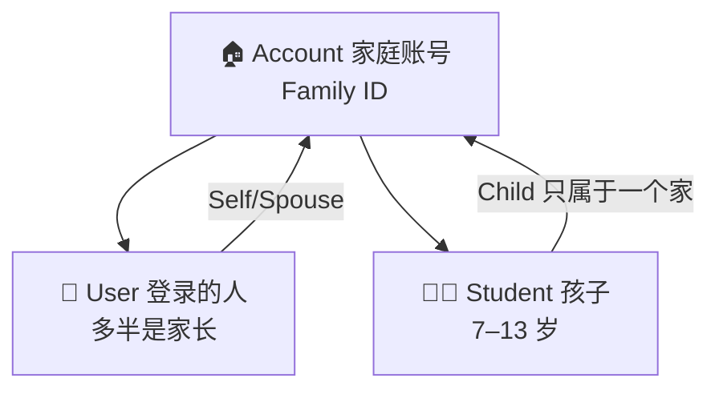
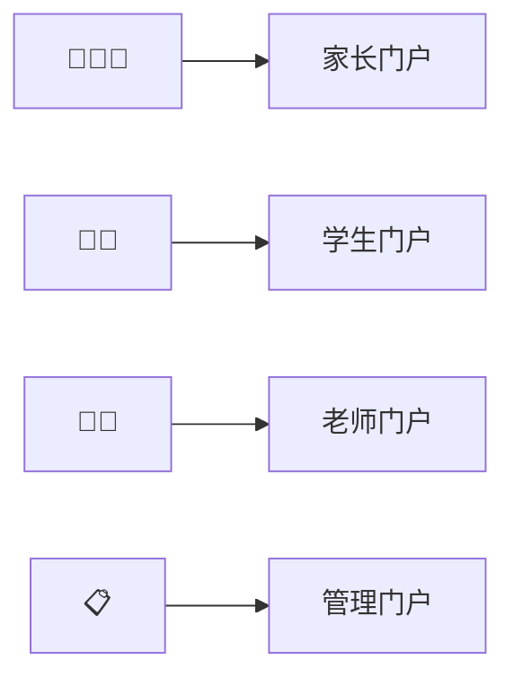

# Glossary

[← Wiki home](../README.md)

## Diagrams

### 🧩 名词一张图看懂

### 🚪 四个门户谁进哪扇门

| Term | Definition |
|------|------------|
| **Account** | A family / billing unit. Has one **primary owner**, zero or more **users** (parents/guardians), and one or more **students**. |
| **Primary owner** | The parent who may manage billing, payments, and adding/removing other users on the account. |
| **User** | A person with login credentials (typically a parent/guardian). May belong to more than one account in edge cases (shared guardianship). |
| **Student** | A child enrolled in the school. Belongs to **exactly one** account. |
| **Staff** | Umbrella for teachers, TAs, and parent volunteers performing school operations (not a single job title). |
| **TA (Teaching Assistant)** | Staff in one class (teacher-level permissions there) but may be a **student** in another class. |
| **Course** | A taught subject for a school year (e.g. Grade 2 Chinese — Class A), with schedule, room, and assigned teacher. |
| **Class / section** | A concrete offering within a grade (e.g. Class A vs Class B) with its own time, teacher, and roster. |
| **LMS** | Learning Management System — assignments, materials, announcements, progress within courses. |
| **RBAC** | Role-Based Access Control — permissions via roles and optional per-user grants. |
| **Delivery mode** | How course content is delivered: `internal` (platform), `google_classroom`, or `hybrid` (future). |
| **Family Identifier** | System-generated ID linking users and students on one account. |
| **Family Relationship** | How a person links to the account: **Self**, **Spouse**, or **Child**. |
| **Parent portal** | Authenticated UI for guardians: family, enrollment, payments, student oversight. |

See [Parent portal](parent-portal.md), [Accounts & enrollment](accounts.md), and [Registration — user fields](registration-user-fields.md).
