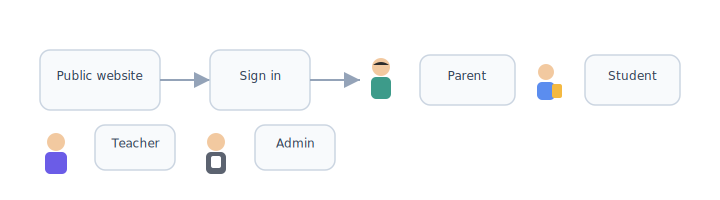

# Glossary

[← Wiki home](../README.md)

## Diagrams

| | | | | |
|:---:|:---:|:---:|:---:|:---:|
|  |  |  |  |  |
| Parent | Student | Teacher | Admin | School |

### Account, user, and student

### Four portals

