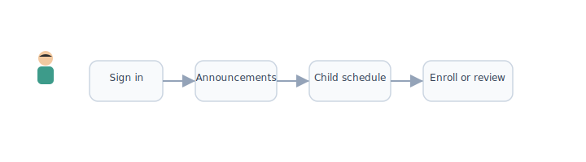

# Parent portal

[← Wiki home](../README.md)

## Audience

Logged-in **parents and guardians** (users with the **Parent** role, and optionally **Spouse** users on a family account). This is the primary portal for families after [registration](registration-user-fields.md).

Parents who also hold **Teacher**, **Staff**, or other roles use the same login; the portal should expose the right tools per role (see [RBAC](rbac.md)).

## Diagrams

**Characters:** Parent · Student (ages 7–13) · Teacher · Admin · School

| | | | | |
|:---:|:---:|:---:|:---:|:---:|
|  |  |  |  |  |
| Parent | Student | Teacher | Admin | School |

### Parent portal hub

### Typical parent session

### Primary parent vs spouse

## Purpose

The parent portal is the **family command center**: manage the account, students, enrollment, payments, and visibility into each child’s school activity—without using the [student portal](student-portal.md) unless viewing as or assisting a child.

---

## Primary features

### Family dashboard

- Overview of all **students** on the account
- **Family Identifier** and account summary
- Quick links: enroll in classes, pay balance, view announcements
- School-wide **announcements** and activity feed (read)

### Account & profile management

| Capability | Primary owner | Other parent (Spouse) |
|------------|---------------|------------------------|
| Edit own profile (nickname, contact, WeChat, email, address) | Yes | Yes |
| Add / remove **Spouse** users on account | Yes | TBD (future: limited access) |
| Add / edit / remove **student** profiles | Yes | Yes (configurable) |
| Manage linked [login methods](authentication.md) | Yes | Own login only |
| View **Family Identifier** | Yes | Yes |

Profile fields: [Registration — user fields](registration-user-fields.md).

### Student management

For each child on the account:

- View and edit student profile (names EN/CN, gender, DOB, regular school, grade)
- View **enrolled classes** for the current year
- Open **read-only** (or assisted) view of student schedule, assignments, and progress — see [Student visibility](#student-visibility)
- Start **new enrollment** for upcoming term

### Registration & enrollment (phase 1)

Central to phase 1 delivery ([Registration & payment](registration-payment.md)):

1. Browse **course catalog** by grade / level (using student DOB and regular-school grade as hints)
2. Select classes per student → **cart**
3. Apply **discounts** (early bird, sibling, multi-class)
4. **Checkout and pay** (primary owner only)
5. View confirmation, receipts, and enrollment status

Non-primary parents may browse and build a cart; **payment** requires primary owner (unless school changes policy).

### Payments & billing

| Feature | Notes |
|---------|--------|
| Payment history | Per student and per term |
| Receipts | Download or resend |
| Unpaid / balance due | Alerts on dashboard |
| Offline payments | Admin-marked paid — visible to parent |

### Student visibility

Parents should see what matters for each child without full teacher tools:

| View | Content |
|------|---------|
| **Schedule** | Daily/weekly class times, teacher, room |
| **Assignments** | Due dates, submission status (not necessarily grade detail for every item — TBD) |
| **Progress** | Grades and completion summary where teachers publish to families |
| **Class announcements** | Posts from teacher/TA for enrolled classes |

*Young students:* if the child has no login, the parent portal is their main window into LMS activity. If the child has a student login, parents still need this view for oversight.

### Announcements & communication

- **School-wide** feed (from admin/staff)
- **Class-level** items for each enrolled student
- Optional: WeChat ID on file for future notification channel (field collected at registration)

### Settings

- Notification preferences (email; SMS/WeChat when integrated)
- Language preference (English / Chinese UI — recommended)
- Switch active **role context** when user is also Teacher or Volunteer

---

## Combined roles (same login)

| User is also… | Portal behavior |
|---------------|-----------------|
| **Teacher** | Link or menu to [Teacher portal](teacher-portal.md) |
| **Volunteer / Staff** | Duty schedule, announcement tools per permissions |
| **Student** (uncommon for parent account) | Link to [Student portal](student-portal.md) for own classes |
| **Admin** | Link to [Admin portal](admin-portal.md) if applicable |

Use one session; do not require a second account.

---

## Requirements

| ID | Requirement | Status |
|----|-------------|--------|
| REQ-PAR-01 | Dedicated **parent portal** for family account management. | Confirmed |
| REQ-PAR-02 | Parents manage **student profiles** and view all children on one dashboard. | Confirmed |
| REQ-PAR-03 | **Primary owner** completes payments; portal shows billing to all parents on account. | Confirmed |
| REQ-PAR-04 | Parents complete **course enrollment** and cart checkout from the portal. | Confirmed (phase 1) |
| REQ-PAR-05 | Parents view each child’s **schedule, assignments, progress, and class announcements**. | Confirmed |
| REQ-PAR-06 | Parents see **school-wide** announcements and feeds. | Confirmed |
| REQ-PAR-07 | Users with Parent + other roles access other portals without re-login. | Confirmed |
| REQ-PAR-08 | Profile and family fields match [user field spec](registration-user-fields.md). | Confirmed |

---

## Open items

| Topic | Question |
|-------|----------|
| Spouse permissions | Can non-primary parent pay or enroll without primary owner approval? |
| Grade visibility | Do parents see exact scores or only status (submitted / graded)? |
| Proxy submission | Can parents upload assignments on behalf of young children? |
| Mobile-first | Confirm phone-first UX (mobile number is primary login). |

---

## Related documents

- [Accounts & enrollment](accounts.md)
- [Registration — user fields](registration-user-fields.md)
- [Registration & payment](registration-payment.md)
- [Student portal](student-portal.md)
- [RBAC](rbac.md)
- [Authentication](authentication.md)
