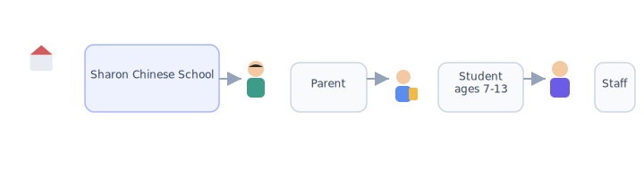
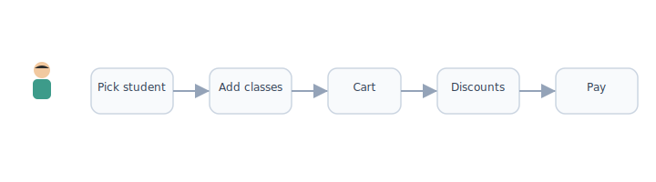

# Platform structure

[← Wiki home](../README.md)

## Diagrams

| | | | | |
|:---:|:---:|:---:|:---:|:---:|
|  |  |  |  |  |
| Parent | Student | Teacher | Admin | School |

### One school, one platform



### Platform layers


### How tuition is collected




## Requirements

| ID | Requirement | Status |
|----|-------------|--------|
| REQ-PLAT-01 | Platform is built for **Sharon Chinese School only** (single tenant). | Confirmed |
| REQ-PLAT-02 | Platform is **not** sold as SaaS to multiple schools in v1. | Confirmed |
| REQ-PLAT-03 | No subscription fee to **access** the platform. | Confirmed |
| REQ-PLAT-04 | Parents **pay for selected courses** during registration (tuition/fees), not platform access. | Confirmed |

## Model

```
┌─────────────────────────────────────────────────────────┐
│              Sharon Chinese School (tenant)              │
├─────────────────────────────────────────────────────────┤
│  Public site          │  Authenticated LMS + portals   │
│  (marketing, info)    │  Parent / Student / Teacher /  │
│                       │  Staff / Admin portals         │
├───────────────────────┴─────────────────────────────────┤
│  Registration & payments │  Schedules │  Courses       │
└─────────────────────────────────────────────────────────┘
```

## Responsibilities split

| Concern | Owner in platform |
|---------|-------------------|
| Family accounts, students, enrollment | Platform |
| Tuition / class payments | Platform (Stripe, Square, or similar) |
| Yearly course catalog & master schedule | Admin |
| Day-to-day class content & grading | Teachers (Google Classroom–like UX) |
| School-wide news & announcements | Admin & staff |
| Class-level announcements | Teachers & TAs |

## Optional future: hybrid delivery

Courses may support a `delivery_mode` field:

| Mode | Platform handles | External (e.g. Google Classroom) |
|------|------------------|----------------------------------|
| `internal` | Full LMS | — |
| `google_classroom` | Registration, accounts, scheduling, announcements | Assignments, materials, grading (TBD) |
| `hybrid` | Mix | Mix |

*v1 target: primarily `internal` with in-person instruction.*

## Related documents

- [Overview](overview.md)
- [Registration & payment](registration-payment.md)
- [Courses & learning](courses.md)
