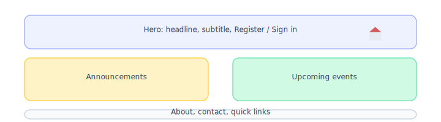
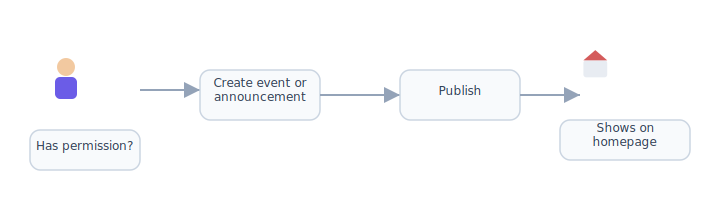
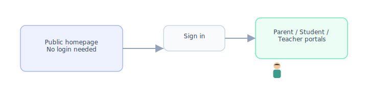

# Public homepage & landing page

[← Wiki home](../README.md) · [Registration flow](registration-flow.md)

## Phase 1

The **public homepage** is a **phase 1 deliverable** (same priority as registration and enrollment). Families and the community must see a professional site before and during signup.

## Summary

The **public homepage** is the first thing visitors see (prospective families, current parents, and the community). As a **nonprofit** school, it must look **professional and modern**, state **who we are** (mission), and surface **events** and **announcements**—while pointing visitors to About, courses, and registration.

Authorized staff post homepage content via **permissions** (see [RBAC](rbac.md)). Full mission and history live on **[About the school](about-school.md)**.

Publishing is **permission-based**: administrators, teachers, staff, and other roles may post **only if** they are granted the right permissions (see [RBAC](rbac.md)).

---

## Goals

| Goal | Detail |
|------|--------|
| **Professional first impression** | Clean layout, readable typography, consistent branding, works on mobile and desktop |
| **Nonprofit credibility** | Mission visible; link to About, leadership, and policies |
| **Modern landing experience** | Contemporary patterns (clear hierarchy, spacing, calls-to-action)—not the cluttered legacy site |
| **Timely public content** | Events and announcements updated by the school without developer involvement |
| **Controlled publishing** | Only users with explicit permissions can add or edit homepage content |

---

## Page structure (recommended)

### Hero section

The hero is the top of the landing page and sets the tone for the whole site.

| Element | Requirement |
|---------|-------------|
| **Headline** | School name + clear value (Chinese language and culture for the community) |
| **Mission line** | **One sentence** from [mission](about-school.md) under the headline (e.g. preserve culture, serve families, partner with community) |
| **Supporting line** | Canton location, weekend program, registration window |
| **Primary CTA** | **Register** (primary) · **Sign in** · **View courses** |
| **Secondary CTA** | **About us** · **Contact** |
| **Visual** | Professional imagery or illustration (school-appropriate; vendor to propose) |
| **Layout** | Full-width, balanced whitespace; readable on phone and desktop |

*Avoid*: cluttered rotating banners, tiny text, or dated table-based layouts like the legacy site.

### Below the hero

| Section | Purpose |
|---------|---------|
| **Mission strip** (recommended) | 2–4 mission bullets or “Who we are” + link to [About](about-school.md) |
| **Announcements** | Short notices (closures, registration dates, policy reminders) |
| **Events** | Upcoming activities (open house, performances, holidays) |
| **Quick links** | About · **Course catalog** · Tuition & policies · Contact · Register · Sign in |
| **Optional (phase 2)** | Gallery, news articles, teaching highlights — see [public site content](public-site-content.md) |

Announcements and events are **required**. Mission strip and quick links are **required** for a professional nonprofit presence.

### Site footer (all public pages)

| Element | Detail |
|---------|---------|
| Contact | admin@sharoncs.org · (781) 363-1186 |
| Location | Canton High School address — see [contact](contact-and-calendar.md) |
| Nonprofit | Sharon Chinese Language School — nonprofit organization |
| Links | About · Contact · Policies · Register |

---

## Who can publish (permission-based)

Posting to the **public homepage** is **not** automatic for every teacher or staff member. The system checks **permissions**, not job titles alone.

| Typical grantee | Homepage permissions (examples) |
|-----------------|----------------------------------|
| **Administrator** | Full: create, edit, publish, unpublish, feature on hero |
| **Staff / communications volunteer** | Post announcements and events when granted |
| **Teacher** | Post only if admin assigns permission (e.g. event for their class or school activity) |
| **Parent / student** | No homepage publishing (read-only on public site) |

### Suggested permissions (RBAC)

| Permission | Allows |
|------------|--------|
| `homepage.post_announcement` | Add/edit homepage announcement items |
| `homepage.post_event` | Add/edit homepage event items |
| `homepage.publish` | Make items visible on the live site (or schedule publish) |
| `homepage.manage` | Admin: all content, ordering, hero highlights, archive |

Admins assign these to **roles** or **individual users** (same model as the rest of the platform).

### Content workflow (recommended)

1. Authorized user signs in (not anonymous posting).
2. Creates draft **announcement** or **event** (title, body, date, optional image/link).
3. Previews how it appears on the homepage.
4. Publishes (or submits for admin approval—**TBD** with school).
5. Item appears in the correct homepage section; optional end date hides it automatically.

---

## Announcements vs events

| Type | Use for | Homepage display |
|------|---------|------------------|
| **Announcement** | Short notices, urgent updates, registration reminders | Announcements list / strip near hero |
| **Event** | Dated activities (open house, party, performances, no-school days) | Events list sorted by date (upcoming first) |

Both types are **public** (visible without login). Logged-in users may see the same items again inside portals—see [Announcements](announcements.md).

---

## Backend configuration

Each dynamic homepage block is managed in the admin backend. Full map: **[Frontend ↔ backend configuration map](frontend-backend-config.md)**.

| Frontend (dynamic) | Configure in admin |
|--------------------|-------------------|
| Hero (headline, image, CTAs) | **Admin → Content → Homepage → Hero** |
| Announcements strip | **Admin → Content → Homepage → Announcements** — [detail](frontend-backend-config.md#homepage-announcements) |
| Events list | **Admin → Content → Homepage → Events** — [detail](frontend-backend-config.md#homepage-events) |
| Footer contact & links | **Admin → Settings → School contact** · **Admin → Content → Navigation / footer** |

Permissions: [RBAC](rbac.md) (`homepage.post_*`, `homepage.publish`).

---

## Requirements

| ID | Requirement | Status |
|----|-------------|--------|
| REQ-HOME-01 | Public homepage has a **professional, modern** design. | Confirmed |
| REQ-HOME-02 | Landing page includes a **professional hero section** with headline and primary CTA. | Confirmed |
| REQ-HOME-03 | Homepage displays **school announcements** and **events** sections. | Confirmed |
| REQ-HOME-04 | Users with the right **permissions** (admin, teacher, staff, etc.) can publish homepage content. | Confirmed |
| REQ-HOME-05 | Users **without** permission cannot publish to the homepage. | Confirmed |
| REQ-HOME-06 | Homepage is **mobile-friendly** and accessible. | Confirmed |
| REQ-HOME-07 | Legacy *Announcement* / *News* content migrates into this model over time. | Planned |
| REQ-HOME-08 | Homepage shows a **short mission** statement and link to About. | Confirmed |
| REQ-HOME-09 | Footer includes contact, location, and nonprofit identity. | Confirmed |
| REQ-HOME-10 | Quick links to **course catalog**, registration, and tuition policies. | Confirmed |

---

## Open items (confirm with school / vendor)

| Topic | Question |
|-------|----------|
| Approval workflow | Publish immediately vs admin approval for non-admin roles? |
| Hero editing | Who may change hero headline/image—admin only? |
| Bilingual copy | English only on public site, or English + Chinese toggle? |
| Featured event | Pin one event in or near the hero? |

---

## Diagrams

| | | | | |
|:---:|:---:|:---:|:---:|:---:|
|  |  |  |  |  |
| Parent | Student | Teacher | Admin | School |

### Homepage layout

### Permission-based publishing

### Public site vs logged-in portals

---

## Related documents

- [About the school](about-school.md) — mission, history, leadership
- [Public site content](public-site-content.md) — catalog, news, migration priorities
- [Contact & school calendar](contact-and-calendar.md)
- [Tuition, discounts & refunds](tuition-policies.md)
- [Announcements & activity feed](announcements.md) — logged-in feeds
- [Legacy content migration](legacy-content-migration.md)
- [RBAC](rbac.md) · [Registration flow](registration-flow.md)
