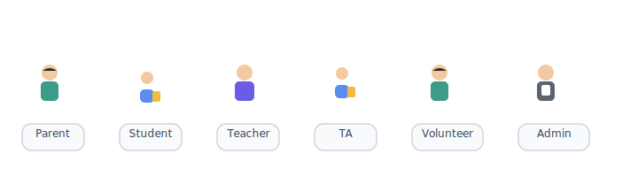
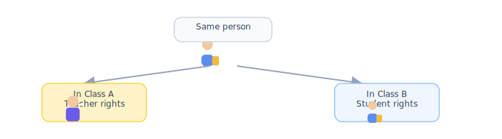
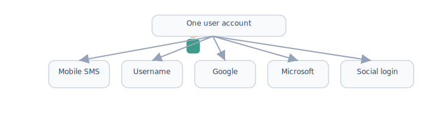

# Roles & permissions (RBAC)

[← Wiki home](../README.md)

## Diagrams

| | | | | |
|:---:|:---:|:---:|:---:|:---:|
|  |  |  |  |  |
| Parent | Student | Teacher | Admin | School |

### School roles

### TA per-class permissions

### Multiple roles, one login

## Principles

| Principle | Detail |
|-----------|--------|
| Permission-based | Every feature maps to granular **permissions** |
| Role assignment | Permissions granted via **roles** and/or **per-user** overrides |
| Multiple roles | One user may hold several roles at once |
| Custom roles | Admins can define new roles and permission sets |

## Default roles

| Role | Typical user | Notes |
|------|--------------|-------|
| **Parent** | Guardian on account | [Parent portal](parent-portal.md): family, enrollment, payments (primary owner), student oversight |
| **Student** | Enrolled child | Own schedule, courses, submissions |
| **Teacher** | Instructor | Course content, grading, class announcements |
| **Staff** | Teachers, TAs, volunteers | School-wide ops, duties, some announcements |
| **Admin** | School administrators | Full configuration and oversight |

## Special cases

### Teaching Assistant (TA)

- In **assigned class**: same privileges as **teacher**
- In **other classes** where enrolled as student: **student** privileges only
- System must resolve context **per course**, not globally per login

### Combined roles

Examples that must work without separate logins:

- Parent + Teacher
- Student + TA

### Volunteers

- May post school-wide content when granted staff announcement permissions
- May appear on **duty schedules** with reminders (see [Admin portal](admin-portal.md))

## Permission examples

| Permission | Parent | Student | Teacher | Admin |
|------------|--------|---------|---------|-------|
| Manage users on account | Primary only | — | — | Yes |
| Create/edit courses | — | — | Own | Yes |
| Assign homework | — | — | Yes | Yes |
| Grade assignments | — | — | Yes | Yes |
| Post school-wide announcement | — | — | — | Yes |
| Post class announcement | — | — | Yes | — |
| Post homepage announcement/event | — | — | If granted | Yes |
| Manage homepage content | — | — | — | Yes |
| Manage master schedule | — | — | Limited | Yes |
| Access payment data | Primary | — | — | Yes |

*Exact matrix to be finalized during implementation.*

## Requirements

| ID | Requirement | Status |
|----|-------------|--------|
| REQ-RBAC-01 | All features controlled via permissions. | Confirmed |
| REQ-RBAC-02 | Permissions assignable to roles and individuals. | Confirmed |
| REQ-RBAC-03 | Users may have multiple simultaneous roles. | Confirmed |
| REQ-RBAC-04 | Admins can create custom roles. | Confirmed |
| REQ-RBAC-05 | TA permissions are **course-scoped**. | Confirmed |
| REQ-RBAC-06 | Students restricted to own data. | Confirmed |

## Homepage permissions

Public site publishing is **not** tied to role name alone. Grant explicitly:

- `homepage.post_announcement`
- `homepage.post_event`
- `homepage.publish`
- `homepage.manage` (admin)

See [Public homepage](public-homepage.md).

## Related documents

- [Public homepage](public-homepage.md)
- [Announcements](announcements.md)
- [Accounts & enrollment](accounts.md)
- [Glossary](glossary.md)
