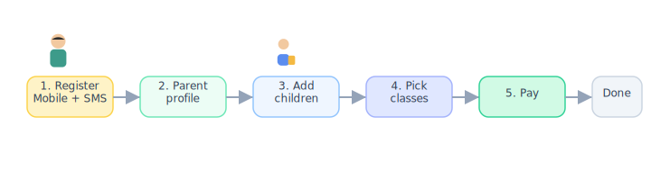

# Registration flow (complete guide)

[← Wiki home](../README.md)

**Audience:** The Web Design LLC and school committee.  
**Purpose:** Single end-to-end reference for **phase 1** — family signup, profiles, class enrollment, and payment.

**Related detail pages:** [User fields](registration-user-fields.md) · [Payment & cart](registration-payment.md) · [Parent portal](parent-portal.md) · [Accounts model](accounts.md) · [Field spreadsheet](WebSiteUserFields.xlsx)

---

## Phase 1 scope

| In scope | Out of scope |
|----------|----------------|
| Parent **self-registration** | Platform subscription fee |
| Family account + student profiles | Admin-created accounts (except assist) |
| Class selection, cart, discounts, pay | Full LMS (assignments, etc.) — later phases |
| Primary owner pays tuition | |

---

## End-to-end flow (summary)

```
Public site (Register) → Sign in / Sign up
  → Mobile + SMS verification + password
  → Parent profile (Self) → Family ID created
  → Add Spouse and/or Children (optional)
  → Enroll each child in classes → Cart → Discounts → Pay
  → Confirmation → Parent portal (ongoing)
```



---

## Step 1 — Entry from public site

| Item | Detail |
|------|--------|
| **Where** | Public homepage — [hero / CTA](public-homepage.md) (Register, Sign in) |
| **Who** | New or returning parent |
| **Outcome** | Directed to registration or login |

Returning users with an account skip to **Sign in** (mobile/SMS, password, or linked social account).

---

## Step 2 — Create account (login credentials)

| # | Screen / action | Data collected | Notes |
|---|-----------------|----------------|-------|
| 2.1 | Enter mobile number | Mobile number | Primary login for phase 1 |
| 2.2 | Verify phone | Verification code (SMS OTP) | Required for new registration |
| 2.3 | Set security | Password, User name (optional) | Username/password also supported later |

**Requirements:** REQ-REG-02, REQ-REG-03 · See [Authentication](authentication.md).

---

## Step 3 — Parent profile (“Self”)

The registering parent completes their own profile and becomes the **primary owner** of a new **family account**.

| # | Data (English) | Required? |
|---|----------------|-----------|
| 3.1 | Nickname | TBD |
| 3.2 | English first / last name, Chinese name | TBD |
| 3.3 | Gender | TBD |
| 3.4 | WeChat ID, Email | TBD |
| 3.5 | Address, City, State, ZIP | TBD |
| 3.6 | School assigned role(s) | Usually **Parent** |

**System:** Assigns **Family Identifier** (unique family / billing ID).

Full field list: [Registration — user fields](registration-user-fields.md) and `WebSiteUserFields.xlsx`.


---

## Step 4 — Add family members (optional)

Same account; relationship drives entity type.

| Relationship | Entity | Typical data |
|--------------|--------|--------------|
| **Self** | Already done in step 3 | — |
| **Spouse** | Second parent user | Profile + contact (same field set as parent) |
| **Child** | Student record | Names, gender, date of birth, current regular school, current grade |

| # | Rule |
|---|------|
| 4.1 | Each **child** belongs to **one** family account only |
| 4.2 | **Spouse** does not replace primary owner unless school reassigns |
| 4.3 | Assign **Student** role on child if they will use student portal |


---

## Step 5 — Enroll in classes

Done in the **[Parent portal](parent-portal.md)** (or continuation of registration wizard).

| # | Screen / action | Detail |
|---|-----------------|--------|
| 5.1 | Select student | Which child to enroll |
| 5.2 | Browse catalog | Classes by grade / subject; use DOB + regular-school grade for placement hints |
| 5.3 | Add to cart | Multiple students and multiple classes allowed |
| 5.4 | Apply discounts | Early bird, sibling, multi-class (rules TBD with school) |
| 5.5 | Review cart | Fees per class, discount lines, total |


---

## Step 6 — Payment & confirmation

| # | Screen / action | Detail |
|---|-----------------|--------|
| 6.1 | Checkout | **Primary owner only** completes payment |
| 6.2 | Pay | Stripe, Square, or similar |
| 6.3 | Confirmation | Success message, enrollment summary |
| 6.4 | Receipt | Email or download; payment status **paid** on account |

**Requirements:** REQ-PAY-01 through REQ-PAY-07 · See [Registration & payment](registration-payment.md).


---

## Step 7 — After registration

| User | What they get |
|------|----------------|
| **Primary parent** | Parent portal: all children, billing, enrollment history |
| **Spouse** | Parent portal (view/manage per permissions; pay only if policy changes) |
| **Student** | Student portal when credentials exist (class schedule, homework) |
| **Admin** | Roster updated; payment and enrollment visible in admin tools |

---

## Alternate path — admin-assisted registration

| When | Flow |
|------|------|
| Parent cannot complete online | Admin creates or fixes account, student, enrollment |
| Policy | **Not** the primary path; audit who created/changed records |

See REQ-ACC-03 in [Accounts & enrollment](accounts.md).

---

## Requirements checklist (phase 1)

| ID | Requirement |
|----|-------------|
| REQ-ACC-01 | Parents self-register |
| REQ-ACC-02 | Parents create and manage student profiles |
| REQ-ACC-04 | One primary owner per family account |
| REQ-REG-01 – 09 | Profile fields and phase 1 priority |
| REQ-PAY-01 – 07 | Cart, discounts, gateway, receipts, admin tracking |

---

## Open items (confirm with school)

| Topic | Question |
|-------|----------|
| Required fields | Mandatory on first visit vs complete later? |
| Student login | Own credentials for young students, or parent-only view? |
| Discount rules | Amounts, dates, stacking |
| Class catalog | Capacity, waitlist, prerequisites |
| Registration wizard | One continuous flow vs separate “profile” then “enroll” screens |

---

## Diagrams

| | | | | |
|:---:|:---:|:---:|:---:|:---:|
|  |  |  |  |  |
| Parent | Student | Teacher | Admin | School |

### Complete flow


### Profile vs enrollment


---

## Document map

| Need | Read |
|------|------|
| Every form field | [registration-user-fields.md](registration-user-fields.md), [WebSiteUserFields.xlsx](WebSiteUserFields.xlsx) |
| Cart, discounts, payments | [registration-payment.md](registration-payment.md) |
| Account / family rules | [accounts.md](accounts.md) |
| Parent UI after signup | [parent-portal.md](parent-portal.md) |
| Login methods | [authentication.md](authentication.md) |
