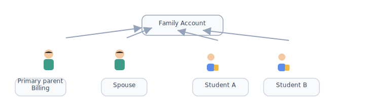

# Registration & payment

[← Wiki home](../README.md) · **[Complete registration flow](registration-flow.md)**

## Phase 1 priority

After the vendor meeting (May 2026), the school confirmed:

> **Registration and course enrollment are the first delivery priority.**

Phase 1 breaks into two parts:

| Part | Document | Status |
|------|----------|--------|
| **A. User & family profiles** | [Registration — user fields](registration-user-fields.md) | Field list from Kyna (`WebSiteUserFields.xlsx`) |
| **B. Course enrollment & payment** | This page (cart, classes, discounts, gateway) | Requirements confirmed; detailed field spec TBD |

Send vendors **both**: profile fields (Excel + wiki) and the enrollment/payment requirements below.

## Diagrams

**Characters:** Parent · Student (ages 7–13) · Teacher · Admin · School

| | | | | |
|:---:|:---:|:---:|:---:|:---:|
|  |  |  |  |  |
| Parent | Student | Teacher | Admin | School |

### Enrollment and payment


### Discount types


### Who can checkout




## Overview

Parents register students for **specific classes** and pay tuition/fees through an integrated checkout flow. There is **no** subscription to use the platform itself.

## User flow

```
Register / verify mobile ──► Complete profile (Self) ──► Add Spouse / Child
    ──► Select student(s) ──► Browse classes ──► Cart ──► Discounts ──► Pay ──► Receipt
```

See [Registration — user fields](registration-user-fields.md) for steps before class selection. Enrollment and checkout live in the **[Parent portal](parent-portal.md)**.

## Class selection

- Browse offerings aligned with [school structure](school-structure.md) (grade, class section, schedule)
- Use student **Date of Birth** and **Current Grade at Regular School** to suggest or restrict levels (rules TBD)
- Enforce prerequisites or capacity limits if school defines them (TBD)
- One cart may include multiple students and multiple classes

## Public course catalog

Before login, visitors can **browse** the current semester course list (name, schedule summary, tuition, early vs regular price). See [Public site content](public-site-content.md) and legacy `/course`.

| ID | Requirement | Status |
|----|-------------|--------|
| REQ-CAT-01 | Anonymous course catalog browse | Confirmed |

---

## Discounts & refunds

Detailed rules (amounts, exclusions, late enrollment, refunds) are documented in **[Tuition, discounts & refunds](tuition-policies.md)** — migrated from the legacy site. Summary:

| Type | Legacy rule (confirm annually) |
|------|-------------------------------|
| Early registration | $15 off per course by deadline |
| Multi-course (3+ youth) | $30/year or $15/semester for 3rd+ course |
| Teacher’s child / Military | $30/year or $15/semester per course |
| Stacking | Discounts **cannot be combined** (legacy) |

Checkout must show applied discounts and link to the full policy page.

## Payment integration

| ID | Requirement | Status |
|----|-------------|--------|
| REQ-PAY-01 | Integrate payment gateway (**Stripe**, **Square**, or similar). | Confirmed |
| REQ-PAY-02 | Track payment status: paid / unpaid / partial. | Confirmed |
| REQ-PAY-03 | Generate or email **receipts** on successful payment. | Confirmed |
| REQ-PAY-04 | Only **primary owner** completes checkout (billing). | Implied |
| REQ-PAY-05 | Admin dashboard for enrollment and payment tracking. | Confirmed |
| REQ-PAY-06 | Admin can manage rosters tied to payment status. | Confirmed |
| REQ-PAY-07 | Phase 1 includes end-to-end **registration + enrollment + payment**. | Confirmed (May 2026) |

## Admin capabilities

- View all enrollments by class and student
- Export roster / payment reports
- Manual adjustments (waivers, refunds) — process TBD
- Mark students paid offline if needed (check/cash) — recommended

## Open items

| Topic | Notes |
|-------|--------|
| Course catalog fields | Class ID, fee, capacity, schedule — vendor sheet TBD |
| Waitlist | When class is full |
| Payment processor | Stripe/Square vs legacy PayPal fee wording |
| Policy dates | Early-bird deadlines per semester |

## Related documents

- [Tuition, discounts & refunds](tuition-policies.md)
- [Registration flow](registration-flow.md)
- [Public site content](public-site-content.md)
- [Parent portal](parent-portal.md)
- [Registration — user fields](registration-user-fields.md)
- [Accounts & enrollment](accounts.md)
- [Platform structure](platform.md)
- [Admin portal](admin-portal.md)
