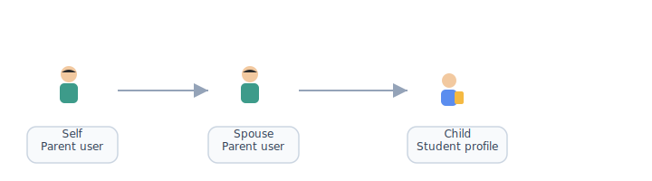
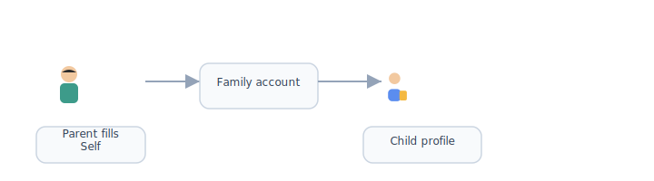

# Registration — user & profile fields

[← Wiki home](../README.md) · [Registration & payment](registration-payment.md)

**Phase 1 priority:** **public homepage** plus registration and course enrollment. This document specifies **data collected at signup** and when adding family members.

Field list: [`WebSiteUserFields.xlsx`](WebSiteUserFields.xlsx).

## Diagrams

| | | | | |
|:---:|:---:|:---:|:---:|:---:|
|  |  |  |  |  |
| Parent | Student | Teacher | Admin | School |

### Signup steps


### Field groups



### Who fills which fields




## Field catalog

| Field (EN) | Description / details | Applies to |
|------------|----------------------|------------|
| Mobile Number | **Phone + SMS** login; OTP at registration. | User (login) |
| Verification Code | SMS OTP for registration / login. | Registration flow |
| Password | Used with **email + password** or after phone signup. | User (login) |
| Email Address | **Email + password** login; contact. | User (login) |
| User Name | Display name (optional; confirm vs email login). | User |
| Nickname | Display name on the platform. | User |
| English First Name | For official enrollment records. | User / Student |
| English Last Name | For official enrollment records. | User / Student |
| Chinese Name | For official enrollment records. | User / Student |
| Gender | Male / Female / Other. | User / Student |
| Date of Birth | Used to determine age group / level. | Student (primarily) |
| WeChat ID | Communication (not a login method). | User |
| Address | Residential address (street). | Account / User |
| City | Residential city. | Account / User |
| State | Residential state. | Account / User |
| Zip Code | Residential ZIP (use **Residential** in UI; fix typo from field list). | Account / User |
| Family Identifier | System-generated family ID. | Account |
| Family Relationship | **Self**, **Spouse**, **Child** | Links person to family account |
| School Assigned Role | Multiple allowed. See [roles](#school-assigned-role). | User |
| Current Regular School Name | Student’s weekday / regular school. | Student |
| Current Grade at Regular School | Used for placement and level hints. | Student |

---

## School assigned role

| Value | Maps to wiki role | Notes |
|-------|-------------------|--------|
| Parent | Parent | Manages account / students; may be primary owner |
| Student | Student | Child learner; portal access per policy |
| Teacher | Teacher | See [RBAC](rbac.md) |
| TA | Staff (TA) | Teacher-level in assigned class only |
| Volunteer | Staff | Duties, announcements per permissions |
| Administrator | Admin | Full management portal |

- A person may have **multiple** roles (e.g. Parent + Teacher, Student + TA).
- **TA** permissions are **course-scoped** — see [RBAC](rbac.md).

---

## Family model mapping

These fields implement the [Account / User / Student](accounts.md) model:

```
Family Identifier  →  Account (system-generated on first family signup)
Family Relationship:
  Self     →  Primary or additional parent User on the account
  Spouse   →  Additional parent User (non-primary unless designated)
  Child    →  Student record on the same account
```

| Relationship | Entity | Typical fields |
|--------------|--------|----------------|
| **Self** | User (parent) | Login via OAuth, email, or phone; nickname, WeChat, address, roles |
| **Spouse** | User (parent) | Same profile fields; permissions may differ from primary owner |
| **Child** | Student | Legal names (EN/CN), gender, DOB, regular school, grade; school roles if student logs in |

**Primary owner** (billing, add/remove parents) is not a separate field — derive from **Self** registrant or explicit designation in admin tools.

### Address scope

| Model | When to use |
|-------|-------------|
| **One address per account** | Simpler billing and mailings; spouse and children inherit unless overridden |
| **Address per user** | Needed if parents live separately but share one family account — confirm with school |

Until decided, collect address on **Self** at signup and allow admin to add per-user addresses later.

### Validation rules (recommended)

| Field | Validation |
|-------|------------|
| Mobile | E.164 or US format; unique per user where phone is login |
| Email | Valid format; unique when used as login |
| Date of birth | Required for **Child** before class enrollment; used for age-band hints |
| ZIP | US ZIP or ZIP+4; label **Residential** in UI (not “Residental”) |
| Family relationship | Exactly one **Self** on initial signup; **Child** rows require legal names |

---

## Registration flow (phase 1)

Recommended order for the vendor:

1. **Account creation** — choose: **Google OAuth**, **Microsoft OAuth**, **email + password**, or **phone + SMS** (see [Authentication](authentication.md)).
2. **Primary profile (Self)** — nickname, names, contact, address, WeChat, email.
3. **Family Identifier** — assign or display system ID.
4. **Add family members** — Spouse and/or Child rows with relationship + profile fields.
5. **School assigned role(s)** — per person; enforce RBAC after save.
6. **Course enrollment** — select classes per student, cart, payment — see [Registration & payment](registration-payment.md).

Families may **save profile and return later** to enroll if the school allows a split wizard; minimum data before checkout must include at least one **Child** with DOB and grade when enrolling students.

### Workflow — new family (happy path)

1. Parent opens **Register** from the public homepage.
2. Chooses Google, Microsoft, email + password, or phone + SMS; completes verification where required.
3. Fills **Self** profile; system assigns **Family Identifier** and sets registrant as **primary owner**.
4. Adds one or more **Child** records (names, DOB, regular school, grade).
5. Optionally adds **Spouse** as second parent user on the same account.
6. Proceeds to class selection per child — see [Registration flow](registration-flow.md).

### Workflow — returning family

1. Parent **Signs in** with any linked method.
2. Updates profiles or adds a new child from the parent portal.
3. Enrolls additional students or classes in a new season without recreating the account.

### Acceptance criteria

- All catalog fields in the table above are persisted on the correct entity (User vs Student vs Account).
- Phone + SMS and email + password paths both create the same underlying user record type; OAuth paths merge into one user after consent.
- Family Identifier is generated once per new account, visible to the family, and stable across seasons.
- Family Relationship is restricted to Self, Spouse, Child; UI prevents marking a child as Self.
- Multiple school roles can be stored per user; RBAC enforces effective permissions after save.
- Student DOB and regular-school grade are available to the enrollment engine for placement hints.
- Profile field required/optional flags are driven from **Admin → Registration → Profile fields** when implemented (see [frontend-backend-config.md](frontend-backend-config.md)).

### Edge cases

- **Duplicate phone or email** — block registration with a clear “Sign in” path if the identifier already exists.
- **OAuth email differs from typed email** — offer linking in account settings; do not create a second family account silently.
- **Two parents, one registers first** — second parent joins via invite or Spouse row; only one primary owner for billing unless admin reassigns.
- **Child already on another account** — school policy may forbid duplicate students; admin merge or support ticket (TBD).
- **Adult student** — rare; may register as User with Student role; DOB and placement rules still apply.
- **Incomplete profile at checkout** — block pay until required student fields for enrolled children are complete.
- **TA or Teacher self-signup** — role assignment may require admin approval before elevated permissions activate.

```
┌─────────────┐     ┌──────────────┐     ┌─────────────────┐     ┌─────────────┐
│ Login/OTP   │ ──► │ Self profile │ ──► │ Add Spouse/Child│ ──► │ Enroll/pay  │
└─────────────┘     └──────────────┘     └─────────────────┘     └─────────────┘
```

---

## Requirements

| ID | Requirement | Status |
|----|-------------|--------|
| REQ-REG-01 | Collect fields per catalog when creating users and students. | Confirmed |
| REQ-REG-02 | **Phone + SMS** supported for login and verification. | Confirmed |
| REQ-REG-02b | **Email + password**, **Google OAuth**, and **Microsoft OAuth** supported. | Confirmed |
| REQ-REG-03 | Support verification code step during registration/login. | Confirmed |
| REQ-REG-04 | Family Identifier is system-generated and visible to the family. | Confirmed |
| REQ-REG-05 | Family Relationship ∈ {Self, Spouse, Child}. | Confirmed |
| REQ-REG-06 | School Assigned Role supports multiple values per user. | Confirmed |
| REQ-REG-07 | Date of Birth used to determine age group / class level. | Confirmed |
| REQ-REG-08 | Current regular school and grade captured for students. | Confirmed |
| REQ-REG-09 | **Homepage** + registration + course enrollment are **phase 1** delivery priority. | Confirmed |

---

## Open items (confirm with school)

| Topic | Question |
|-------|----------|
| Required vs optional | Which fields are mandatory on first signup vs later? |
| User Name field | Display only vs alternate login — confirm with school (login is email or phone/OAuth). |
| WeChat notifications | In-app only in v1, or WeChat API integration? |
| Child login | Do students get credentials when role = Student? |
| Address scope | One address per **account** vs per **user**? |
| Bilingual UI (optional) | If the school wants Chinese UI labels, provide copy in the spreadsheet — not required for phase 1 vendor build. |

---

## Related documents

- [Parent portal](parent-portal.md) — where families use these fields after signup
- [Registration & payment](registration-payment.md) — cart, discounts, gateways
- [Accounts & enrollment](accounts.md) — account model
- [Authentication](authentication.md) — SMS OTP and social login
- [RBAC](rbac.md) — role permissions
