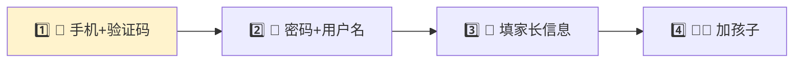
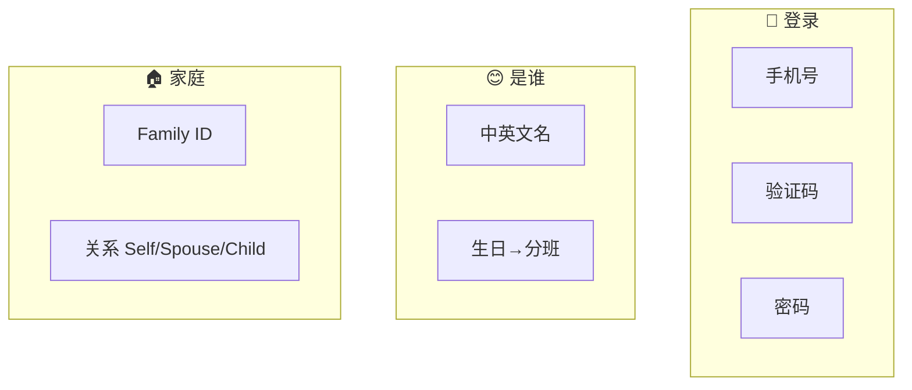
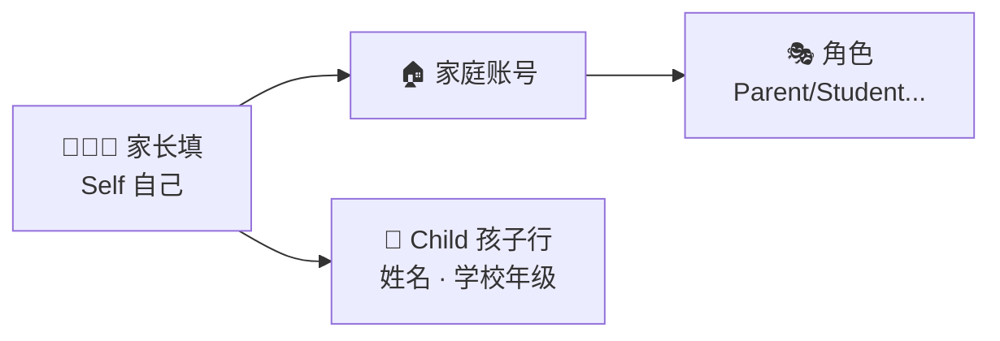

# Registration — user & profile fields

[← Wiki home](../README.md) · [Registration & payment](registration-payment.md)

**Phase 1 priority** (agreed with The Web Design LLC, May 2026): **public homepage** plus registration and course enrollment. This document specifies **data collected at signup** and when adding family members.

**Source:** `WebSiteUserFields.xlsx` (Kyna, 2026) — also in the parent project `documents/` folder. A copy is stored in this repo as [`WebSiteUserFields.xlsx`](WebSiteUserFields.xlsx).

## Diagrams

### 📱 注册四步（像填表）



### 🗂️ 字段分三组



### 🏠 填表时谁在填什么



---

## Field catalog

| Field (CN) | Field (EN) | Description / details | Applies to |
|------------|------------|----------------------|------------|
| 手机号 | Mobile Number | **Phone + SMS** login; OTP at registration. | User (login) |
| 验证码 | Verification Code | SMS OTP for registration / login. | Registration flow |
| 密码 | Password | Used with **email + password** or after phone signup. | User (login) |
| 电子邮箱 | Email Address | **Email + password** login; contact. | User (login) |
| — | User Name | Display / login name (optional; confirm vs email). | User |
| 昵称 | Nickname | Display name on the platform. | User |
| 真实姓名 | English First Name | For official enrollment records. | User / Student |
| — | English Last Name | For official enrollment records. | User / Student |
| — | Chinese Name | For official enrollment records. | User / Student |
| 性别 | Gender | Male / Female / Other. | User / Student |
| 出生日期 | Date of Birth | Used to determine age group / level. | Student (primarily) |
| 微信号 | WeChat ID | For communication and notifications (not a login method). | User |
| 居住地址 | Address | Residential address (street). | Account / User |
| — | City | Residential city. | Account / User |
| — | State | Residential state. | Account / User |
| — | Zip Code | Residential ZIP (source sheet: “Recidential Zip” — use **Residential** in UI). | Account / User |
| — | Family Identifier | System-generated family ID. | Account |
| — | Family Relationship | **Self**, **Spouse**, **Child** | Links person to family account |
| — | School Assigned Role | Multiple allowed. See [roles](#school-assigned-role). | User |
| — | Current Regular School Name | Student’s weekday / regular school. | Student |
| — | Current Grade at Regular School | Used for placement and level hints. | Student |

### Notes on bilingual labels

- Rows with **CN** “真实姓名” map to **English First Name** in the spreadsheet; **English Last Name** and **Chinese Name** are separate fields (CN labels TBD in Excel).
- **User Name** has no CN label in the current sheet — confirm UI copy with school.

---

## School assigned role

| Value | Maps to wiki role | Notes |
|-------|-------------------|--------|
| Parent | Parent | Manages account / students; may be primary owner |
| Student | Student | Child learner; portal access per policy |
| Teacher | Teacher | See [RBAC](rbac.md) |
| TA | Staff (TA) | Teacher-level in assigned class only |
| Volunteer | Staff | Duties, announcements per permissions |
| Administrator | Admin | Full management portal |

- A person may have **multiple** roles (e.g. Parent + Teacher, Student + TA).
- **TA** permissions are **course-scoped** — see [RBAC](rbac.md).

---

## Family model mapping

These fields implement the [Account / User / Student](accounts.md) model:

```
Family Identifier  →  Account (system-generated on first family signup)
Family Relationship:
  Self     →  Primary or additional parent User on the account
  Spouse   →  Additional parent User (non-primary unless designated)
  Child    →  Student record on the same account
```

| Relationship | Entity | Typical fields |
|--------------|--------|----------------|
| **Self** | User (parent) | Login via OAuth, email, or phone; nickname, WeChat, address, roles |
| **Spouse** | User (parent) | Same profile fields; permissions may differ from primary owner |
| **Child** | Student | Legal names (EN/CN), gender, DOB, regular school, grade; school roles if student logs in |

**Primary owner** (billing, add/remove parents) is not a separate field — derive from **Self** registrant or explicit designation in admin tools.

---

## Registration flow (phase 1)

Recommended order for the vendor:

1. **Account creation** — choose: **Google OAuth**, **Microsoft OAuth**, **email + password**, or **phone + SMS** (see [Authentication](authentication.md)).
2. **Primary profile (Self)** — nickname, names, contact, address, WeChat, email.
3. **Family Identifier** — assign or display system ID.
4. **Add family members** — Spouse and/or Child rows with relationship + profile fields.
5. **School assigned role(s)** — per person; enforce RBAC after save.
6. **Course enrollment** — select classes per student, cart, payment — see [Registration & payment](registration-payment.md).

```
┌─────────────┐     ┌──────────────┐     ┌─────────────────┐     ┌─────────────┐
│ Login/OTP   │ ──► │ Self profile │ ──► │ Add Spouse/Child│ ──► │ Enroll/pay  │
└─────────────┘     └──────────────┘     └─────────────────┘     └─────────────┘
```

---

## Requirements

| ID | Requirement | Status |
|----|-------------|--------|
| REQ-REG-01 | Collect fields per catalog when creating users and students. | Confirmed (May 2026) |
| REQ-REG-02 | **Phone + SMS** supported for login and verification. | Confirmed |
| REQ-REG-02b | **Email + password**, **Google OAuth**, and **Microsoft OAuth** supported. | Confirmed |
| REQ-REG-03 | Support verification code step during registration/login. | Confirmed |
| REQ-REG-04 | Family Identifier is system-generated and visible to the family. | Confirmed |
| REQ-REG-05 | Family Relationship ∈ {Self, Spouse, Child}. | Confirmed |
| REQ-REG-06 | School Assigned Role supports multiple values per user. | Confirmed |
| REQ-REG-07 | Date of Birth used to determine age group / class level. | Confirmed |
| REQ-REG-08 | Current regular school and grade captured for students. | Confirmed |
| REQ-REG-09 | **Homepage** + registration + course enrollment are **phase 1** delivery priority. | Confirmed (vendor meeting) |

---

## Open items (confirm with school)

| Topic | Question |
|-------|----------|
| Required vs optional | Which fields are mandatory on first signup vs later? |
| User Name field | Display only vs alternate login — confirm with school (login is email or phone/OAuth). |
| WeChat notifications | In-app only in v1, or WeChat API integration? |
| Child login | Do students get credentials when role = Student? |
| Address scope | One address per **account** vs per **user**? |
| CN UI labels | Complete Chinese labels for User Name, Last Name, City, State, etc. |

---

## Related documents

- [Parent portal](parent-portal.md) — where families use these fields after signup
- [Registration & payment](registration-payment.md) — cart, discounts, gateways
- [Accounts & enrollment](accounts.md) — account model
- [Authentication](authentication.md) — SMS OTP and social login
- [RBAC](rbac.md) — role permissions
