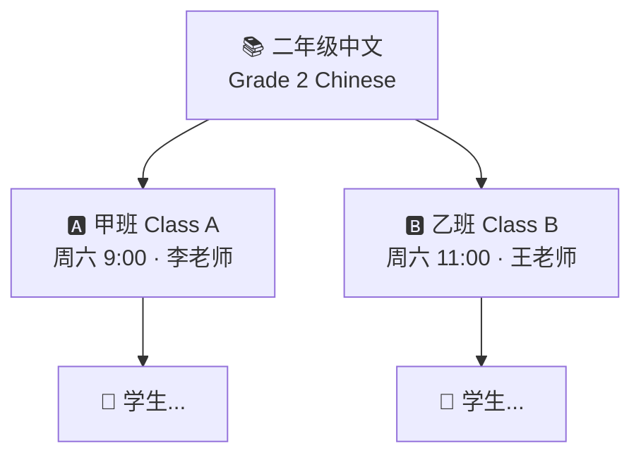
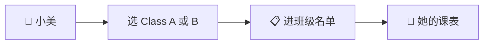
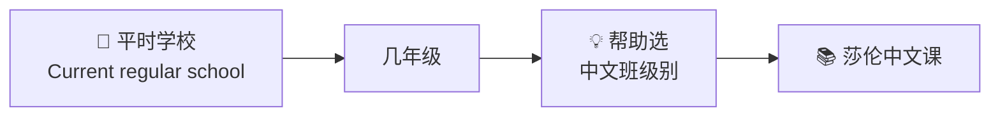

# School structure

[← Wiki home](../README.md)

## Diagrams

### 🌳 年级 → 多个班



### 🎒 一个学生选哪一班



### 🏫 和平时上的学校不同



## Hierarchy

Sharon Chinese School organizes instruction roughly as:

```
Grade (e.g. Grade 2 Chinese)
 └── Class A  (time, teacher, room, roster)
 └── Class B  (different time/teacher possible)
      └── Students (enrolled per class)
```

## Requirements

| ID | Requirement | Status |
|----|-------------|--------|
| REQ-SCH-01 | A **grade** can have **multiple classes** (sections). | Confirmed |
| REQ-SCH-02 | Classes under the same grade may differ in **time**, **teacher**, and **room**. | Confirmed |
| REQ-SCH-03 | Example: *Grade 2 Chinese* → *Class A* and *Class B*. | Confirmed |
| REQ-SCH-04 | Students enroll in specific **class offerings**, not only a grade label. | Implied |

## Example

| Grade | Class | Schedule | Teacher | Room |
|-------|-------|----------|---------|------|
| Grade 2 Chinese | A | Sat 9:00 | Ms. Li | Room 101 |
| Grade 2 Chinese | B | Sat 11:00 | Mr. Wang | Room 102 |

## Roster rules

- Student belongs to one **account** (family)
- Student may be enrolled in one or more **courses/classes** per semester/year
- Class roster drives teacher gradebook and announcements

## Announcement targeting

| Level | Example | Who posts (see [Announcements](announcements.md)) |
|-------|---------|--------------------------------------------------|
| School-wide | Snow day, registration open | Admin, staff |
| Class-specific | Homework due Friday | Teacher, TA |
| Grade-level | Optional future | TBD |

## Related documents

- [Courses & learning](courses.md)
- [Registration & payment](registration-payment.md)
