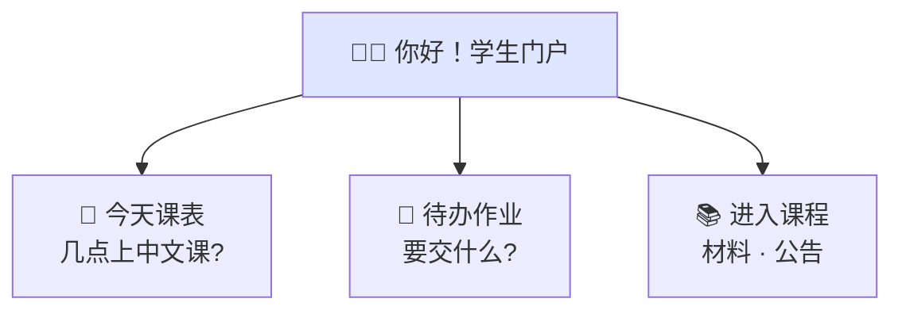
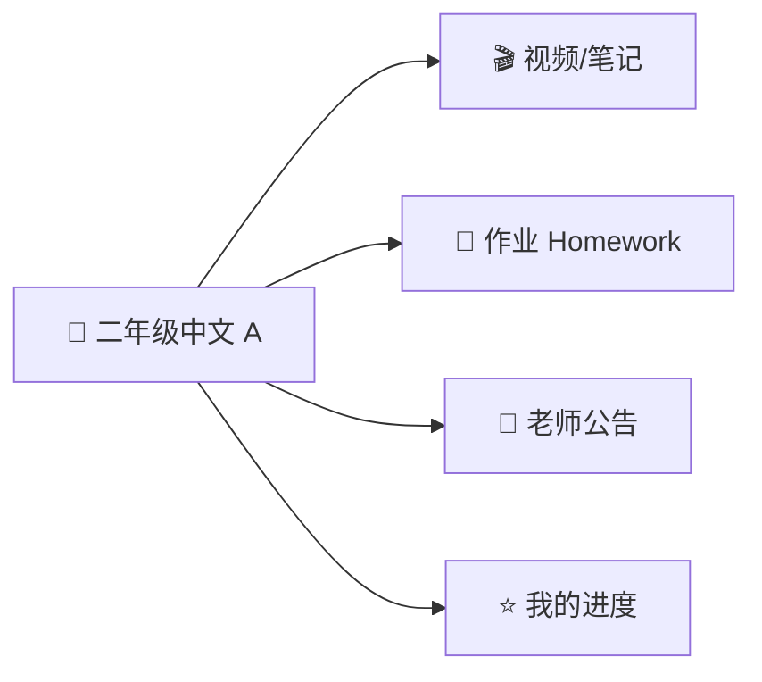
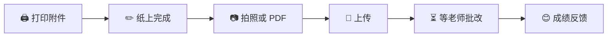

# Student portal

[← Wiki home](../README.md)

## Audience

Logged-in **students**. Parents monitor and manage children through the **[Parent portal](parent-portal.md)** (schedule, assignments, progress)—not by default through this portal. Confirm whether young students without their own login ever use this UI via a parent “act as student” mode (TBD).

## Diagrams

### 🎒 学生门户（7–13 岁）

### 📚 一节课里有什么

### 📤 交作业小流程

## Primary features

### Dashboard

- **Daily schedule** — subjects, times, teachers, optional room/location
- **Task overview** — upcoming assignments and exams across courses

### Per-course page

Each enrolled course exposes a learning hub (teacher-controlled visibility):

| Content | Description |
|---------|-------------|
| Lessons / modules | Structured units when teacher organizes them |
| Materials | PDFs, videos, notes |
| Assignments | Due dates, attachments, submission status |
| Announcements | Class-specific posts from teacher or TA |
| Progress | Completion and grading summary where applicable |

## Requirements

| ID | Requirement | Status |
|----|-------------|--------|
| REQ-STU-01 | Students see a **daily schedule** on the dashboard. | Confirmed |
| REQ-STU-02 | Master schedule data is **admin-defined** for the year; teachers/admins may adjust single sessions. | Confirmed |
| REQ-STU-03 | Course pages show materials, assignments, announcements, and progress as enabled by teacher. | Confirmed |
| REQ-STU-04 | Students submit assignment/exam work as **PDF or image** uploads after printing attachments if needed. | Confirmed |
| REQ-STU-05 | Students only access **their own** data and enrolled courses. | Confirmed |

## Schedule fields

Each schedule entry should support at minimum:

- Subject / course
- Teacher
- Time slot
- Classroom / location (optional)

## Related documents

- [Parent portal](parent-portal.md)
- [Courses & learning](courses.md)
- [Teacher portal](teacher-portal.md)
- [School structure](school-structure.md)
- [RBAC](rbac.md)
