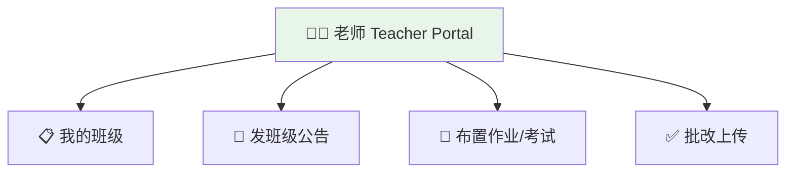
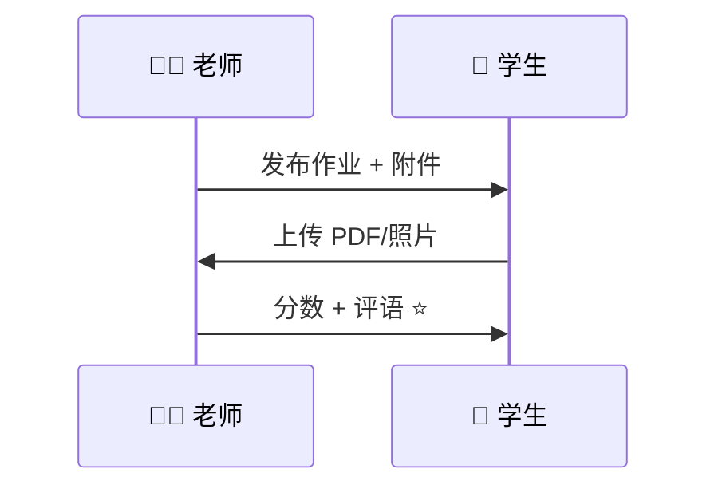
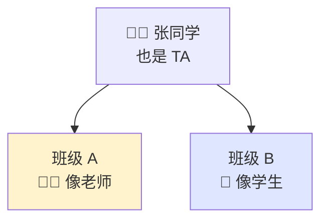

# Teacher portal

[← Wiki home](../README.md)

## Diagrams

### 👩‍🏫 老师工作台

### 📝 批改作业（像判卷子）

### 🎭 助教 TA：两顶帽子

## Audience

**Teachers** and **TAs** (in classes where they act as teacher).

## Primary features

### My courses

- List of assigned courses for the current school year
- Quick access to each course’s content and roster

### Course content management

- Create and organize modules/lessons (flexible, Google Classroom–style)
- Upload videos, PDFs, notes
- Publish or hide items for students
- Post **class-level** announcements (with TA where permitted)

### Assignments & exams

| Capability | Detail |
|------------|--------|
| Create work | Assignments and exams with **attachments** |
| Differentiation | Assign **different work to different students** in the same class |
| Submissions | Students upload **PDF or photos** of completed work |
| Grading | Score, feedback, return to student |

### Schedule operations

- View master timetable for assigned courses
- **Reschedule a single class** (with admin alignment on policy)
- Request or record **substitute teacher** for a session

## Requirements

| ID | Requirement | Status |
|----|-------------|--------|
| REQ-TCH-01 | Teachers create assignments and exams with attachments. | Confirmed |
| REQ-TCH-02 | Teachers grade PDF/image submissions with feedback. | Confirmed |
| REQ-TCH-03 | Teachers can target assignments to subsets of students. | Confirmed |
| REQ-TCH-04 | Teachers control student-visible content on course pages. | Confirmed |
| REQ-TCH-05 | Teachers and TAs may post **class-level** announcements. | Confirmed |
| REQ-TCH-06 | Teachers can reschedule individual sessions (with admin). | Confirmed |
| REQ-TCH-07 | Teachers can assign substitute for a single session. | Confirmed |

## TA note

A user who is **TA** in Course A has teacher-level tools in Course A only. In courses where they are enrolled as a **student**, they see the [student portal](student-portal.md) only.

See [RBAC](rbac.md).

## Related documents

- [Courses & learning](courses.md)
- [Admin portal](admin-portal.md)
- [Announcements](announcements.md)
