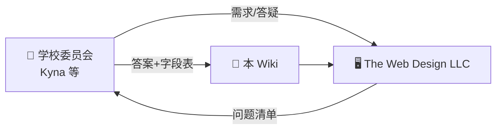
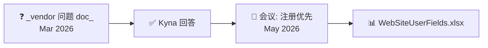
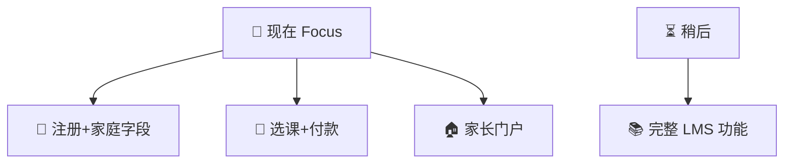

# Vendor Q&A log

[← Wiki home](../README.md)

Questions from **The Web Design LLC** and answers from the school (primarily **Kyna**, 2026-03-21). Use this page when resolving ambiguities; update the component docs when answers change.

## Diagrams

### 🤝 学校 ↔ 外包公司怎么协作

### 📅 问答时间线

### 🥇 他们现在最该做什么

---

## 1. Platform structure

**Q:** Single school or multi-school SaaS? Subscription for roles?

**A:**

- Sharon Chinese School **only**; not SaaS in v1
- **No** platform subscription
- Parents **register students for classes** and **pay for courses**

→ [Platform structure](platform.md)

---

## 2. User enrollment & account creation

**Q:** Admin-created accounts vs self-signup?

**A:**

- Parents **self-register**
- Parents create/manage **student** profiles
- Admins assist only when needed
- Distinguish **Account**, **User**, **Student** — see [Accounts](accounts.md)

---

## 3. Courses & learning structure

**Q:** Full online courses vs in-person support?

**A:**

- **In-person first**; LMS for assignments, communication, tracking
- Admin sets courses yearly; teachers upload materials and choose elements (video, PDF, etc.)
- Google Classroom–like flexibility
- Optional future `delivery_mode`: internal / google_classroom / hybrid

→ [Courses & learning](courses.md)

---

## 4. Student portal

**Q:** Who builds daily schedule? What’s on the course page?

**A:**

- Schedule: **admin** master data; teachers/admins adjust single sessions
- Course page: **yes** to modules, materials, assignments, announcements, progress — teacher controls visibility

→ [Student portal](student-portal.md)

---

## 5. Teacher portal — exams

**Q:** How should exams work?

**A:**

- Teachers create assignments/exams with **attachments**
- Students **print**, complete, upload **PDF or photo**
- Teachers assign **different work to different students**
- Grading with feedback

→ [Teacher portal](teacher-portal.md)

---

## 6. Admin portal — staff & schedule

**Q:** What is “Staff”? Timetable? Curriculum components?

**A:**

- **Staff** = teachers, TAs, parent volunteers
- **TA**: teacher rights in assigned class; student rights elsewhere
- Volunteers: announcements, duty calendar, **reminders** before shifts
- Admin sets yearly course, time, room, teacher; teacher+admin **reschedule** one session; **substitute** per session
- Curriculum: **copy Google Classroom** model

→ [Admin portal](admin-portal.md), [RBAC](rbac.md)

---

## 7. School structure

**Q:** Grade → section → students? Multiple sections?

**A:**

- Grade can have **multiple classes** (e.g. Grade 2 Chinese Class A and B)
- Different times, teachers per class

→ [School structure](school-structure.md)

---

## 8. Activity feeds & announcements

**Q:** Who posts? Visibility levels?

**A:**

- **Admin & staff** → school-wide
- **Teachers & TAs** → class-level
- Grade-level visibility: **optional future**

→ [Announcements](announcements.md)

---

## 9. Roles & permissions

Documented in consolidated requirements — see [RBAC](rbac.md).

---

## 10. Authentication

Documented in consolidated requirements — see [Authentication](authentication.md).

---

## 11. Registration & payment

**Status:** Marked “to be defined” in Q&A doc; consolidated requirements add cart, discounts, Stripe/Square. See [Registration & payment](registration-payment.md) for open items.

---

## 12. Vendor meeting — registration priority (May 2026)

**Context:** Meeting with The Web Design LLC. School emphasized **registration / course enrollment first**; phase 1 now also includes the **public homepage** (hero, mission, events, announcements).

**Vendor request:** More detail on registration data.

**School response:** Kyna provided profile field specification:

- WeChat summary table → **`WebSiteUserFields.xlsx`**
- Wiki: [Registration — user fields](registration-user-fields.md)

**Fields cover:** login (Google, Microsoft, email/password, phone/SMS), profile names (EN/CN), nickname, gender, DOB, WeChat ID, email, address, family ID/relationship, school roles, student’s regular school and grade.

---

## Original question document

Full vendor question list (without answers): see parent project `documents/ShaornCS-lms-queries (1).docx`.
